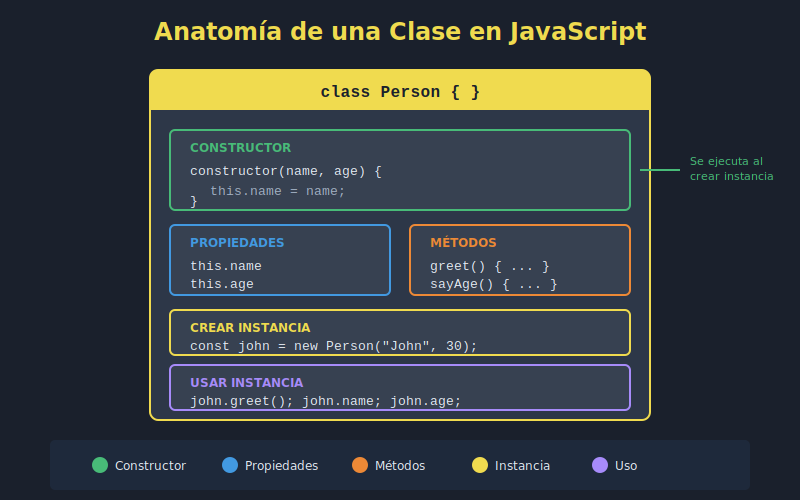

# 📘 Clases Básicas en JavaScript ES2023

## 🎯 Objetivos

- Comprender la sintaxis de clases en JavaScript moderno
- Crear clases con constructores y propiedades
- Definir métodos de instancia
- Entender la diferencia entre clases y objetos literales

---

## �️ Diagrama



---

## �📋 Contenido

### 1. ¿Qué son las Clases?

Las clases en JavaScript son **"azúcar sintáctica"** sobre el sistema de prototipos existente. Proporcionan una sintaxis más clara y familiar para crear objetos y manejar herencia.

```javascript
// Crear una clase básica
class User {
  constructor(name, email) {
    this.name = name;
    this.email = email;
  }

  greet() {
    return `Hello, I'm ${this.name}!`;
  }
}

// Crear instancias
const user1 = new User('Ana', 'ana@email.com');
const user2 = new User('Carlos', 'carlos@email.com');

console.log(user1.greet()); // "Hello, I'm Ana!"
console.log(user2.greet()); // "Hello, I'm Carlos!"
```

### 2. Anatomía de una Clase

```javascript
class ClassName {
  // Constructor: se ejecuta al crear una instancia
  constructor(param1, param2) {
    // Propiedades de instancia
    this.property1 = param1;
    this.property2 = param2;
  }

  // Métodos de instancia
  methodName() {
    // Acceso a propiedades con this
    return this.property1;
  }

  // Método que usa otros métodos
  anotherMethod() {
    return this.methodName() + ' processed';
  }
}
```

### 3. El Constructor

El `constructor` es un método especial que se ejecuta automáticamente cuando creamos una nueva instancia con `new`.

```javascript
class Product {
  constructor(name, price, category) {
    // Inicializar propiedades
    this.name = name;
    this.price = price;
    this.category = category;

    // Propiedades calculadas
    this.createdAt = new Date();
    this.id = crypto.randomUUID();
  }
}

const laptop = new Product('MacBook Pro', 1999, 'Electronics');
console.log(laptop.id);        // UUID generado
console.log(laptop.createdAt); // Fecha de creación
```

#### Constructor con Valores por Defecto

```javascript
class Config {
  constructor(options = {}) {
    this.theme = options.theme ?? 'dark';
    this.language = options.language ?? 'es';
    this.notifications = options.notifications ?? true;
  }
}

const defaultConfig = new Config();
console.log(defaultConfig.theme); // "dark"

const customConfig = new Config({ theme: 'light', language: 'en' });
console.log(customConfig.theme); // "light"
```

### 4. Métodos de Instancia

Los métodos de instancia son funciones que operan sobre datos específicos de cada instancia.

```javascript
class BankAccount {
  constructor(owner, initialBalance = 0) {
    this.owner = owner;
    this.balance = initialBalance;
    this.transactions = [];
  }

  deposit(amount) {
    if (amount <= 0) {
      throw new Error('Amount must be positive');
    }
    this.balance += amount;
    this.transactions.push({
      type: 'deposit',
      amount,
      date: new Date()
    });
    return this.balance;
  }

  withdraw(amount) {
    if (amount > this.balance) {
      throw new Error('Insufficient funds');
    }
    this.balance -= amount;
    this.transactions.push({
      type: 'withdrawal',
      amount,
      date: new Date()
    });
    return this.balance;
  }

  getStatement() {
    return this.transactions.map(t =>
      `${t.type}: $${t.amount} on ${t.date.toLocaleDateString()}`
    );
  }
}

const account = new BankAccount('Ana García', 1000);
account.deposit(500);
account.withdraw(200);
console.log(account.balance); // 1300
console.log(account.getStatement());
```

### 5. Propiedades de Clase (Class Fields)

ES2022 introdujo la declaración de propiedades directamente en el cuerpo de la clase:

```javascript
class Counter {
  // Propiedad de clase con valor inicial
  count = 0;
  step = 1;

  constructor(initialCount = 0, step = 1) {
    this.count = initialCount;
    this.step = step;
  }

  increment() {
    this.count += this.step;
  }

  decrement() {
    this.count -= this.step;
  }

  reset() {
    this.count = 0;
  }
}

const counter = new Counter(10, 5);
counter.increment();
console.log(counter.count); // 15
```

### 6. Clases vs Objetos Literales

#### Cuándo usar Objetos Literales

```javascript
// ✅ Un único objeto con datos estáticos
const config = {
  apiUrl: 'https://api.example.com',
  timeout: 3000,
  retries: 3
};

// ✅ Objeto simple sin comportamiento complejo
const point = { x: 10, y: 20 };
```

#### Cuándo usar Clases

```javascript
// ✅ Múltiples instancias con el mismo comportamiento
class Point {
  constructor(x, y) {
    this.x = x;
    this.y = y;
  }

  distanceTo(other) {
    const dx = this.x - other.x;
    const dy = this.y - other.y;
    return Math.sqrt(dx * dx + dy * dy);
  }

  move(dx, dy) {
    this.x += dx;
    this.y += dy;
    return this;
  }
}

const p1 = new Point(0, 0);
const p2 = new Point(3, 4);
console.log(p1.distanceTo(p2)); // 5
```

### 7. Encadenamiento de Métodos (Method Chaining)

Retornando `this` desde los métodos, podemos encadenar llamadas:

```javascript
class StringBuilder {
  constructor() {
    this.value = '';
  }

  append(str) {
    this.value += str;
    return this; // Permite encadenar
  }

  appendLine(str) {
    this.value += str + '\n';
    return this;
  }

  clear() {
    this.value = '';
    return this;
  }

  toString() {
    return this.value;
  }
}

const text = new StringBuilder()
  .append('Hello ')
  .append('World')
  .appendLine('!')
  .append('Welcome')
  .toString();

console.log(text);
// "Hello World!
// Welcome"
```

### 8. Ejemplo Completo: Sistema de Tareas

```javascript
class Task {
  // Propiedades de clase
  static taskCount = 0;

  constructor(title, description = '', priority = 'medium') {
    this.id = ++Task.taskCount;
    this.title = title;
    this.description = description;
    this.priority = priority;
    this.completed = false;
    this.createdAt = new Date();
    this.completedAt = null;
  }

  complete() {
    if (this.completed) {
      console.log(`Task "${this.title}" is already completed`);
      return this;
    }
    this.completed = true;
    this.completedAt = new Date();
    return this;
  }

  reopen() {
    this.completed = false;
    this.completedAt = null;
    return this;
  }

  updatePriority(newPriority) {
    const validPriorities = ['low', 'medium', 'high', 'urgent'];
    if (!validPriorities.includes(newPriority)) {
      throw new Error(`Invalid priority. Use: ${validPriorities.join(', ')}`);
    }
    this.priority = newPriority;
    return this;
  }

  getInfo() {
    const status = this.completed ? '✅' : '⏳';
    return `${status} [${this.priority.toUpperCase()}] ${this.title}`;
  }

  toJSON() {
    return {
      id: this.id,
      title: this.title,
      description: this.description,
      priority: this.priority,
      completed: this.completed,
      createdAt: this.createdAt.toISOString(),
      completedAt: this.completedAt?.toISOString() ?? null
    };
  }
}

// Uso
const task1 = new Task('Learn ES2023 Classes', 'Study the basics', 'high');
const task2 = new Task('Practice coding');

console.log(task1.getInfo()); // "⏳ [HIGH] Learn ES2023 Classes"
task1.complete();
console.log(task1.getInfo()); // "✅ [HIGH] Learn ES2023 Classes"

console.log(Task.taskCount); // 2
```

---

## 💡 Mejores Prácticas

### ✅ Hacer

```javascript
// Nombres descriptivos en PascalCase
class ShoppingCart { }
class UserAuthentication { }

// Constructor conciso
class User {
  constructor(name, email) {
    this.name = name;
    this.email = email;
  }
}

// Métodos con una sola responsabilidad
class Calculator {
  add(a, b) { return a + b; }
  subtract(a, b) { return a - b; }
}
```

### ❌ Evitar

```javascript
// Nombres poco descriptivos
class Data { }
class Manager { }

// Constructor con demasiada lógica
class User {
  constructor(data) {
    // ❌ Demasiada lógica en constructor
    this.name = data.name;
    this.email = data.email;
    this.validateEmail();
    this.sendWelcomeEmail();
    this.logCreation();
    this.updateStatistics();
  }
}

// Métodos que hacen demasiado
class Order {
  processOrder() {
    // ❌ Hace validación, cálculo, guardado, email...
  }
}
```

---

## 🧪 Ejercicios Rápidos

### Ejercicio 1: Clase Rectangle

Crea una clase `Rectangle` con:
- Constructor que reciba `width` y `height`
- Método `area()` que retorne el área
- Método `perimeter()` que retorne el perímetro
- Método `isSquare()` que indique si es un cuadrado

### Ejercicio 2: Clase TodoList

Crea una clase `TodoList` con:
- Array interno de tareas
- Método `add(task)` para agregar tareas
- Método `remove(index)` para eliminar
- Método `toggle(index)` para marcar como completada
- Método `getPending()` que retorne tareas pendientes

---

## 📚 Recursos Adicionales

- [MDN: Classes](https://developer.mozilla.org/es/docs/Web/JavaScript/Reference/Classes)
- [JavaScript.info: Class basic syntax](https://javascript.info/class)
- [ES2023 Classes in Depth](https://exploringjs.com/es6/ch_classes.html)

---

## ✅ Checklist de Verificación

- [ ] Puedo crear una clase con constructor
- [ ] Sé cómo definir propiedades de instancia
- [ ] Puedo crear métodos que operen sobre this
- [ ] Entiendo cuándo usar clases vs objetos literales
- [ ] Puedo implementar method chaining
- [ ] Sé usar valores por defecto en constructores
