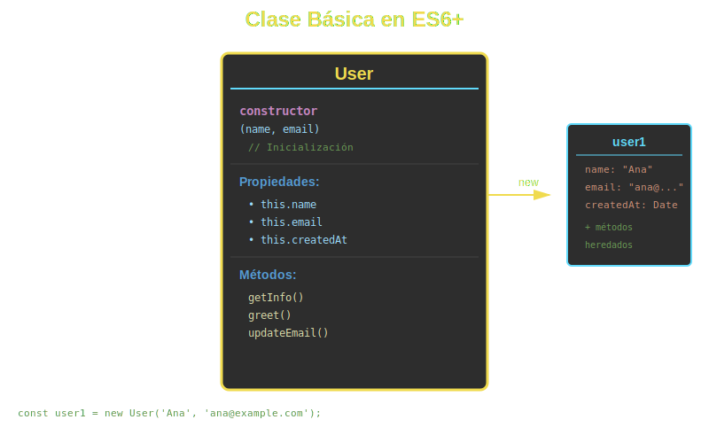

# 📦 Clases Básicas en ES6+



## 🎯 Objetivos

- Comprender qué son las clases en JavaScript ES6+
- Crear clases con constructores
- Definir métodos de instancia
- Instanciar objetos a partir de clases
- Entender `this` en el contexto de clases

---

## 📖 Introducción

Las **clases** en ES6+ son una forma más limpia y orientada a objetos de crear objetos y manejar herencia. Aunque JavaScript sigue siendo basado en prototipos, la sintaxis de clases hace el código más legible y fácil de mantener.

### Antes de ES6 (Función Constructora)

```javascript
// ❌ Antiguo - Función constructora
function Person(name, age) {
  this.name = name;
  this.age = age;
}

Person.prototype.greet = function() {
  return 'Hi, I\'m ' + this.name;
};

const person = new Person('Ana', 25);
```

### Con ES6+ (Clases)

```javascript
// ✅ Moderno - Clase ES6
class Person {
  constructor(name, age) {
    this.name = name;
    this.age = age;
  }

  greet() {
    return `Hi, I'm ${this.name}`;
  }
}

const person = new Person('Ana', 25);
```

> **💡 Nota**: Las clases ES6 son "syntactic sugar" sobre el sistema de prototipos de JavaScript.

---

## 🏗️ Estructura de una Clase

### Sintaxis Básica

```javascript
class ClassName {
  // Constructor: se ejecuta al crear una instancia
  constructor(param1, param2) {
    this.property1 = param1;
    this.property2 = param2;
  }

  // Método de instancia
  methodName() {
    return this.property1;
  }

  // Otro método
  anotherMethod() {
    // ...
  }
}
```

### Componentes Clave

1. **`class` keyword**: Define una clase
2. **`constructor`**: Método especial para inicializar propiedades
3. **`this`**: Referencia a la instancia actual
4. **Métodos**: Funciones que pertenecen a la clase

---

## 🔨 El Constructor

El constructor es un método especial que se ejecuta automáticamente cuando se crea una nueva instancia.

### Constructor Básico

```javascript
class User {
  constructor(username, email) {
    this.username = username;
    this.email = email;
    this.createdAt = new Date();
  }
}

const user = new User('johndoe', 'john@example.com');
console.log(user.username);  // 'johndoe'
console.log(user.createdAt); // fecha actual
```

### Constructor con Validación

```javascript
class Product {
  constructor(name, price) {
    if (price < 0) {
      throw new Error('Price cannot be negative');
    }

    this.name = name;
    this.price = price;
  }
}

const product = new Product('Laptop', 999); // ✅ OK
// const invalid = new Product('Item', -10); // ❌ Error
```

### Constructor con Valores por Defecto

```javascript
class Configuration {
  constructor(theme = 'light', language = 'en') {
    this.theme = theme;
    this.language = language;
  }
}

const config1 = new Configuration(); // theme: 'light', language: 'en'
const config2 = new Configuration('dark', 'es'); // theme: 'dark', language: 'es'
```

---

## 🎭 Métodos de Instancia

Los métodos de instancia son funciones que pueden ser llamadas en cualquier instancia de la clase.

### Definición de Métodos

```javascript
class Calculator {
  constructor() {
    this.result = 0;
  }

  add(num) {
    this.result += num;
    return this; // Permite chaining
  }

  subtract(num) {
    this.result -= num;
    return this;
  }

  getResult() {
    return this.result;
  }
}

const calc = new Calculator();
const result = calc.add(10).subtract(3).getResult(); // 7
```

### Métodos que Acceden a Propiedades

```javascript
class BankAccount {
  constructor(owner, balance = 0) {
    this.owner = owner;
    this.balance = balance;
  }

  deposit(amount) {
    if (amount <= 0) {
      throw new Error('Amount must be positive');
    }
    this.balance += amount;
    return `Deposited ${amount}. New balance: ${this.balance}`;
  }

  withdraw(amount) {
    if (amount > this.balance) {
      throw new Error('Insufficient funds');
    }
    this.balance -= amount;
    return `Withdrew ${amount}. Remaining: ${this.balance}`;
  }

  getBalance() {
    return this.balance;
  }
}

const account = new BankAccount('Alice', 100);
console.log(account.deposit(50));  // "Deposited 50. New balance: 150"
console.log(account.withdraw(30)); // "Withdrew 30. Remaining: 120"
```

### Métodos que Llaman a Otros Métodos

```javascript
class TodoList {
  constructor() {
    this.todos = [];
  }

  addTodo(text) {
    this.todos.push({ id: Date.now(), text, completed: false });
  }

  getTodoById(id) {
    return this.todos.find(todo => todo.id === id);
  }

  completeTodo(id) {
    const todo = this.getTodoById(id); // Llama a otro método
    if (todo) {
      todo.completed = true;
    }
  }

  getAll() {
    return this.todos;
  }
}
```

---

## 🔍 El Contexto `this`

`this` dentro de una clase siempre se refiere a la instancia actual.

### `this` en Métodos

```javascript
class Circle {
  constructor(radius) {
    this.radius = radius;
  }

  getArea() {
    // this se refiere a la instancia actual
    return Math.PI * this.radius ** 2;
  }

  getCircumference() {
    // this.radius es accesible en todos los métodos
    return 2 * Math.PI * this.radius;
  }
}

const circle = new Circle(5);
console.log(circle.getArea());          // 78.54
console.log(circle.getCircumference()); // 31.42
```

### ⚠️ Cuidado con Arrow Functions

```javascript
class Counter {
  constructor() {
    this.count = 0;
  }

  // ❌ Arrow function como método (NO recomendado en clases)
  incrementArrow = () => {
    this.count++;
  };

  // ✅ Método normal (recomendado)
  increment() {
    this.count++;
  }
}
```

> **💡 Regla**: Usa métodos normales en clases, no arrow functions.

---

## 🎨 Ejemplo Completo

```javascript
class ShoppingCart {
  constructor() {
    this.items = [];
    this.discount = 0;
  }

  addItem(product, quantity = 1) {
    const existingItem = this.items.find(item => item.product.id === product.id);

    if (existingItem) {
      existingItem.quantity += quantity;
    } else {
      this.items.push({ product, quantity });
    }

    return this; // Chaining
  }

  removeItem(productId) {
    this.items = this.items.filter(item => item.product.id !== productId);
    return this;
  }

  setDiscount(percentage) {
    if (percentage < 0 || percentage > 100) {
      throw new Error('Discount must be between 0 and 100');
    }
    this.discount = percentage;
    return this;
  }

  getSubtotal() {
    return this.items.reduce((sum, item) => {
      return sum + (item.product.price * item.quantity);
    }, 0);
  }

  getTotal() {
    const subtotal = this.getSubtotal();
    const discountAmount = subtotal * (this.discount / 100);
    return subtotal - discountAmount;
  }

  getSummary() {
    return {
      itemCount: this.items.length,
      subtotal: this.getSubtotal(),
      discount: this.discount,
      total: this.getTotal()
    };
  }
}

// Uso
const cart = new ShoppingCart();

cart
  .addItem({ id: 1, name: 'Laptop', price: 999 }, 1)
  .addItem({ id: 2, name: 'Mouse', price: 25 }, 2)
  .setDiscount(10);

console.log(cart.getSummary());
/*
{
  itemCount: 2,
  subtotal: 1049,
  discount: 10,
  total: 944.1
}
*/
```

---

## 📊 Comparación: Función vs Clase

| Característica  | Función Constructora   | Clase ES6                               |
| --------------- | ---------------------- | --------------------------------------- |
| Sintaxis        | `function Person() {}` | `class Person {}`                       |
| Constructor     | La función misma       | Método `constructor()`                  |
| Métodos         | En `prototype`         | Dentro de la clase                      |
| Legibilidad     | Menos clara            | Más clara                               |
| Hoisting        | Sí                     | No (no se puede usar antes de declarar) |
| `new` requerido | Sí                     | Sí                                      |

---

## 🎯 Casos de Uso Comunes

### 1. Modelo de Datos

```javascript
class Book {
  constructor(title, author, isbn) {
    this.title = title;
    this.author = author;
    this.isbn = isbn;
    this.available = true;
  }

  borrow() {
    if (!this.available) {
      throw new Error('Book not available');
    }
    this.available = false;
  }

  return() {
    this.available = true;
  }

  getInfo() {
    return `${this.title} by ${this.author}`;
  }
}
```

### 2. Validador

```javascript
class EmailValidator {
  constructor(email) {
    this.email = email;
  }

  isValid() {
    const regex = /^[^\s@]+@[^\s@]+\.[^\s@]+$/;
    return regex.test(this.email);
  }

  getDomain() {
    return this.email.split('@')[1];
  }
}

const validator = new EmailValidator('user@example.com');
console.log(validator.isValid()); // true
console.log(validator.getDomain()); // 'example.com'
```

### 3. Componente UI

```javascript
class Modal {
  constructor(title, content) {
    this.title = title;
    this.content = content;
    this.isOpen = false;
  }

  open() {
    this.isOpen = true;
    console.log(`Opening modal: ${this.title}`);
  }

  close() {
    this.isOpen = false;
    console.log('Closing modal');
  }

  render() {
    return `
      <div class="modal ${this.isOpen ? 'open' : ''}">
        <h2>${this.title}</h2>
        <p>${this.content}</p>
      </div>
    `;
  }
}
```

---

## ⚠️ Errores Comunes

### 1. Olvidar `new`

```javascript
class Person {
  constructor(name) {
    this.name = name;
  }
}

// ❌ Error: Cannot call a class as a function
// const person = Person('Ana');

// ✅ Correcto
const person = new Person('Ana');
```

### 2. Acceder a Propiedades sin `this`

```javascript
class Counter {
  constructor() {
    this.count = 0;
  }

  increment() {
    // ❌ Error: count is not defined
    // count++;

    // ✅ Correcto
    this.count++;
  }
}
```

### 3. Definir Métodos con Arrow Functions en el Constructor

```javascript
class Button {
  constructor() {
    // ❌ No recomendado: cada instancia tiene su propia copia
    this.click = () => {
      console.log('Clicked');
    };
  }
}

// ✅ Mejor: método compartido
class Button {
  click() {
    console.log('Clicked');
  }
}
```

---

## ✅ Mejores Prácticas

1. **Nombres en PascalCase**: `class UserAccount` (no `class userAccount`)
2. **Constructor simple**: Solo inicializa propiedades
3. **Métodos pequeños**: Una responsabilidad por método
4. **Validación en constructor**: Valida parámetros temprano
5. **Retorna `this`**: Para permitir method chaining
6. **Usa nombres descriptivos**: `getUserProfile()` vs `get()`

---

## 🎓 Ejercicios

### Ejercicio 1: Clase Rectangle

Crea una clase `Rectangle` con:
- Constructor que recibe `width` y `height`
- Método `getArea()` que retorna el área
- Método `getPerimeter()` que retorna el perímetro
- Método `isSquare()` que retorna true si es un cuadrado

<details>
<summary>Ver solución</summary>

```javascript
class Rectangle {
  constructor(width, height) {
    this.width = width;
    this.height = height;
  }

  getArea() {
    return this.width * this.height;
  }

  getPerimeter() {
    return 2 * (this.width + this.height);
  }

  isSquare() {
    return this.width === this.height;
  }
}

const rect = new Rectangle(5, 10);
console.log(rect.getArea());      // 50
console.log(rect.getPerimeter()); // 30
console.log(rect.isSquare());     // false

const square = new Rectangle(5, 5);
console.log(square.isSquare());   // true
```
</details>

### Ejercicio 2: Clase TaskManager

Crea una clase `TaskManager` con:
- Array de tareas
- Método `addTask(title)` que agrega una tarea
- Método `completeTask(id)` que marca como completada
- Método `getPending()` que retorna tareas pendientes
- Método `getCompleted()` que retorna tareas completadas

<details>
<summary>Ver solución</summary>

```javascript
class TaskManager {
  constructor() {
    this.tasks = [];
  }

  addTask(title) {
    const task = {
      id: Date.now(),
      title,
      completed: false
    };
    this.tasks.push(task);
    return task;
  }

  completeTask(id) {
    const task = this.tasks.find(t => t.id === id);
    if (task) {
      task.completed = true;
    }
  }

  getPending() {
    return this.tasks.filter(t => !t.completed);
  }

  getCompleted() {
    return this.tasks.filter(t => t.completed);
  }
}

const manager = new TaskManager();
manager.addTask('Learn Classes');
manager.addTask('Practice OOP');
manager.completeTask(manager.tasks[0].id);

console.log(manager.getPending());   // 1 tarea
console.log(manager.getCompleted()); // 1 tarea
```
</details>

---

## 📚 Recursos Adicionales

- [MDN - Classes](https://developer.mozilla.org/es/docs/Web/JavaScript/Reference/Classes)
- [JavaScript.info - Classes](https://javascript.info/class)
- [Eloquent JavaScript - The Secret Life of Objects](https://eloquentjavascript.net/06_object.html)

---

## 🔗 Navegación

- [← Week 03: README](../README.md)
- [→ Siguiente: Herencia](02-herencia.md)

---

**Próximo tema**: Aprenderás sobre **herencia** y cómo extender clases con `extends` y `super`.
