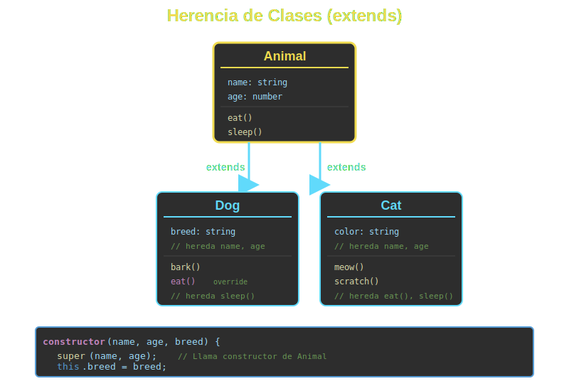

# 🔄 Herencia en ES6+



## 🎯 Objetivos

- Comprender el concepto de herencia en JavaScript
- Usar `extends` para crear jerarquías de clases
- Utilizar `super` para acceder a la clase padre
- Sobrescribir métodos (method overriding)
- Diseñar jerarquías de clases efectivas

---

## 📖 Introducción

La **herencia** permite que una clase (hija/subclase) herede propiedades y métodos de otra clase (padre/superclase). Esto promueve la reutilización de código y establece relaciones "es-un" entre objetos.

### Ejemplo Básico

```javascript
// Clase padre (superclase)
class Animal {
  constructor(name) {
    this.name = name;
  }

  makeSound() {
    return 'Some generic sound';
  }
}

// Clase hija (subclase)
class Dog extends Animal {
  makeSound() {
    return 'Woof!';
  }
}

const dog = new Dog('Rex');
console.log(dog.name);       // 'Rex' (heredado)
console.log(dog.makeSound()); // 'Woof!' (sobrescrito)
```

---

## 🔗 La Palabra Clave `extends`

`extends` establece la relación de herencia entre clases.

### Sintaxis

```javascript
class SubClass extends SuperClass {
  // ...
}
```

### Ejemplo: Jerarquía de Vehículos

```javascript
class Vehicle {
  constructor(brand, model) {
    this.brand = brand;
    this.model = model;
  }

  getInfo() {
    return `${this.brand} ${this.model}`;
  }

  start() {
    return 'Vehicle starting...';
  }
}

class Car extends Vehicle {
  constructor(brand, model, doors) {
    super(brand, model); // Llama al constructor padre
    this.doors = doors;
  }

  getInfo() {
    return `${super.getInfo()} (${this.doors} doors)`;
  }
}

class Motorcycle extends Vehicle {
  constructor(brand, model, type) {
    super(brand, model);
    this.type = type; // sport, cruiser, etc.
  }

  getInfo() {
    return `${super.getInfo()} - ${this.type}`;
  }
}

const car = new Car('Toyota', 'Corolla', 4);
const moto = new Motorcycle('Honda', 'CBR', 'sport');

console.log(car.getInfo());  // "Toyota Corolla (4 doors)"
console.log(moto.getInfo()); // "Honda CBR - sport"
```

---

## 🎯 La Palabra Clave `super`

`super` se usa para acceder al constructor y métodos de la clase padre.

### 1. `super()` en el Constructor

**Regla importante**: Si defines un constructor en la subclase, **DEBES** llamar a `super()` antes de usar `this`.

```javascript
class Person {
  constructor(name, age) {
    this.name = name;
    this.age = age;
  }
}

class Employee extends Person {
  constructor(name, age, position, salary) {
    // ❌ Error: Must call super constructor before using 'this'
    // this.position = position;

    // ✅ Correcto: primero super()
    super(name, age);
    this.position = position;
    this.salary = salary;
  }

  getDetails() {
    return `${this.name}, ${this.position} - $${this.salary}`;
  }
}

const emp = new Employee('Ana', 30, 'Developer', 60000);
console.log(emp.getDetails()); // "Ana, Developer - $60000"
```

### 2. `super.method()` para Llamar Métodos del Padre

```javascript
class Shape {
  constructor(color) {
    this.color = color;
  }

  describe() {
    return `A ${this.color} shape`;
  }
}

class Circle extends Shape {
  constructor(color, radius) {
    super(color);
    this.radius = radius;
  }

  describe() {
    // Llama al método del padre y extiende su funcionalidad
    return `${super.describe()} with radius ${this.radius}`;
  }

  getArea() {
    return Math.PI * this.radius ** 2;
  }
}

const circle = new Circle('red', 5);
console.log(circle.describe()); // "A red shape with radius 5"
console.log(circle.getArea());  // 78.54
```

---

## 🔄 Method Overriding (Sobrescritura de Métodos)

Las subclases pueden sobrescribir métodos de la superclase.

### Sobrescritura Completa

```javascript
class Animal {
  move() {
    return 'Moving...';
  }
}

class Bird extends Animal {
  // Sobrescribe completamente el método
  move() {
    return 'Flying in the sky';
  }
}

class Fish extends Animal {
  move() {
    return 'Swimming in water';
  }
}

const bird = new Bird();
const fish = new Fish();

console.log(bird.move()); // "Flying in the sky"
console.log(fish.move()); // "Swimming in water"
```

### Sobrescritura Parcial (con `super`)

```javascript
class Logger {
  log(message) {
    console.log(`[LOG] ${message}`);
  }
}

class TimestampLogger extends Logger {
  log(message) {
    const timestamp = new Date().toISOString();
    // Llama al método padre y agrega funcionalidad
    super.log(`${timestamp} - ${message}`);
  }
}

const logger = new TimestampLogger();
logger.log('Application started');
// [LOG] 2024-12-18T10:30:00.000Z - Application started
```

---

## 🏗️ Jerarquías de Clases

### Ejemplo: Sistema de Usuarios

```javascript
class User {
  constructor(username, email) {
    this.username = username;
    this.email = email;
    this.createdAt = new Date();
  }

  getProfile() {
    return {
      username: this.username,
      email: this.email,
      role: this.constructor.name
    };
  }
}

class RegularUser extends User {
  constructor(username, email) {
    super(username, email);
    this.maxProjects = 5;
  }

  canCreateProject() {
    return true;
  }
}

class PremiumUser extends User {
  constructor(username, email, subscriptionEnd) {
    super(username, email);
    this.subscriptionEnd = subscriptionEnd;
    this.maxProjects = Infinity;
  }

  canCreateProject() {
    return new Date() < this.subscriptionEnd;
  }

  getProfile() {
    return {
      ...super.getProfile(),
      premium: true,
      subscriptionEnd: this.subscriptionEnd
    };
  }
}

class Admin extends User {
  constructor(username, email, permissions = []) {
    super(username, email);
    this.permissions = permissions;
  }

  hasPermission(permission) {
    return this.permissions.includes(permission);
  }

  canCreateProject() {
    return true;
  }
}

// Uso
const regular = new RegularUser('john', 'john@example.com');
const premium = new PremiumUser('jane', 'jane@example.com', new Date('2025-12-31'));
const admin = new Admin('admin', 'admin@example.com', ['create', 'delete', 'manage']);

console.log(regular.getProfile());
console.log(premium.canCreateProject()); // true si no ha expirado
console.log(admin.hasPermission('delete')); // true
```

---

## 🔍 Verificación de Tipos

### `instanceof`

```javascript
class Animal {}
class Dog extends Animal {}
class Cat extends Animal {}

const dog = new Dog();

console.log(dog instanceof Dog);    // true
console.log(dog instanceof Animal); // true
console.log(dog instanceof Cat);    // false
console.log(dog instanceof Object); // true (todo hereda de Object)
```

### Uso Práctico

```javascript
class Product {
  constructor(name, price) {
    this.name = name;
    this.price = price;
  }
}

class DigitalProduct extends Product {
  constructor(name, price, downloadUrl) {
    super(name, price);
    this.downloadUrl = downloadUrl;
  }
}

class PhysicalProduct extends Product {
  constructor(name, price, weight) {
    super(name, price);
    this.weight = weight;
  }
}

const calculateShipping = (product) => {
  if (product instanceof PhysicalProduct) {
    return product.weight * 2; // $2 por kg
  }
  return 0; // Digital products no tienen envío
};

const ebook = new DigitalProduct('JS Book', 19.99, 'http://...');
const laptop = new PhysicalProduct('Laptop', 999, 2.5);

console.log(calculateShipping(ebook));  // 0
console.log(calculateShipping(laptop)); // 5
```

---

## 🎨 Patrones Comunes

### 1. Clase Base Abstracta (Simulada)

```javascript
class PaymentMethod {
  constructor(amount) {
    if (this.constructor === PaymentMethod) {
      throw new Error('PaymentMethod is abstract and cannot be instantiated');
    }
    this.amount = amount;
  }

  process() {
    throw new Error('Method process() must be implemented');
  }
}

class CreditCard extends PaymentMethod {
  constructor(amount, cardNumber) {
    super(amount);
    this.cardNumber = cardNumber;
  }

  process() {
    return `Processing ${this.amount} via Credit Card ending in ${this.cardNumber.slice(-4)}`;
  }
}

class PayPal extends PaymentMethod {
  constructor(amount, email) {
    super(amount);
    this.email = email;
  }

  process() {
    return `Processing ${this.amount} via PayPal (${this.email})`;
  }
}

// const payment = new PaymentMethod(100); // ❌ Error
const cc = new CreditCard(100, '1234567890123456');
console.log(cc.process()); // ✅ OK
```

### 2. Cadena de Herencia

```javascript
class LivingBeing {
  constructor(name) {
    this.name = name;
  }

  breathe() {
    return `${this.name} is breathing`;
  }
}

class Animal extends LivingBeing {
  constructor(name, species) {
    super(name);
    this.species = species;
  }

  move() {
    return `${this.name} is moving`;
  }
}

class Mammal extends Animal {
  constructor(name, species, furColor) {
    super(name, species);
    this.furColor = furColor;
  }

  feedYoung() {
    return `${this.name} is feeding its young`;
  }
}

class Dog extends Mammal {
  constructor(name, breed, furColor) {
    super(name, 'Canis familiaris', furColor);
    this.breed = breed;
  }

  bark() {
    return 'Woof!';
  }
}

const dog = new Dog('Rex', 'Labrador', 'golden');
console.log(dog.breathe());    // De LivingBeing
console.log(dog.move());       // De Animal
console.log(dog.feedYoung());  // De Mammal
console.log(dog.bark());       // De Dog
```

---

## ⚠️ Errores Comunes

### 1. Olvidar `super()` en Constructor

```javascript
class Parent {
  constructor(name) {
    this.name = name;
  }
}

class Child extends Parent {
  constructor(name, age) {
    // ❌ Error: Must call super constructor
    // this.age = age;

    // ✅ Correcto
    super(name);
    this.age = age;
  }
}
```

### 2. Usar `super` sin `extends`

```javascript
class MyClass {
  constructor() {
    // ❌ Error: 'super' keyword unexpected here
    // super();
  }
}
```

### 3. Herencia Múltiple (No Soportada)

```javascript
class A {}
class B {}

// ❌ JavaScript no soporta herencia múltiple
// class C extends A, B {} // Syntax Error

// ✅ Alternativa: Composición con mixins (tema avanzado)
```

---

## ✅ Mejores Prácticas

1. **Jerarquías poco profundas**: Máximo 2-3 niveles de herencia
2. **Usa `super` apropiadamente**: Siempre en constructor antes de `this`
3. **Sobrescribe con propósito**: Solo cuando agrega valor
4. **Composición sobre herencia**: A veces es mejor componer que heredar
5. **Relación "es-un"**: Solo usa herencia si hay una relación real

---

## 🎓 Ejercicios

### Ejercicio 1: Figuras Geométricas

Crea una jerarquía:
- `Shape` (base): color
- `Rectangle extends Shape`: width, height, getArea()
- `Square extends Rectangle`: solo width (height = width)

<details>
<summary>Ver solución</summary>

```javascript
class Shape {
  constructor(color) {
    this.color = color;
  }

  describe() {
    return `A ${this.color} shape`;
  }
}

class Rectangle extends Shape {
  constructor(color, width, height) {
    super(color);
    this.width = width;
    this.height = height;
  }

  getArea() {
    return this.width * this.height;
  }

  describe() {
    return `${super.describe()} - Rectangle ${this.width}x${this.height}`;
  }
}

class Square extends Rectangle {
  constructor(color, size) {
    super(color, size, size);
  }

  describe() {
    return `${super.describe()} (Square)`;
  }
}

const rect = new Rectangle('blue', 5, 10);
const square = new Square('red', 5);

console.log(rect.describe());    // "A blue shape - Rectangle 5x10"
console.log(square.describe());  // "A red shape - Rectangle 5x5 (Square)"
console.log(square.getArea());   // 25
```
</details>

---

## 📚 Recursos Adicionales

- [MDN - extends](https://developer.mozilla.org/es/docs/Web/JavaScript/Reference/Classes/extends)
- [MDN - super](https://developer.mozilla.org/es/docs/Web/JavaScript/Reference/Operators/super)
- [JavaScript.info - Class Inheritance](https://javascript.info/class-inheritance)

---

## 🔗 Navegación

- [← Anterior: Clases Básicas](01-clases-basicas.md)
- [Week 03: README](../README.md)
- [→ Siguiente: Getters y Setters](03-getters-setters.md)

---

**Próximo tema**: Aprenderás sobre **getters y setters** para controlar el acceso a propiedades.
