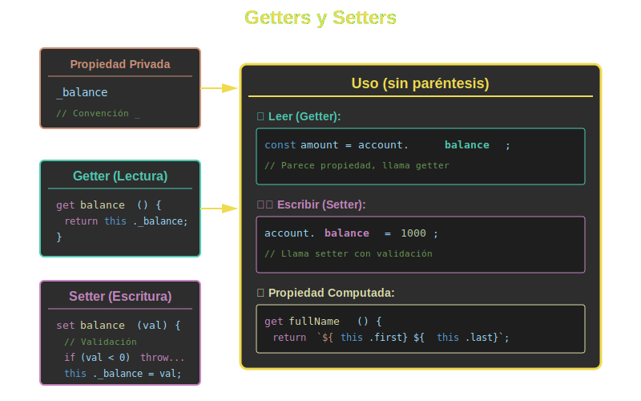

# 🎛️ Getters y Setters en ES6+



## 🎯 Objetivos

- Entender qué son los getters y setters
- Usar `get` y `set` para controlar el acceso a propiedades
- Implementar validación en setters
- Crear propiedades computadas con getters
- Aplicar encapsulación efectiva

---

## 📖 Introducción

Los **getters** y **setters** son métodos especiales que permiten leer y escribir propiedades de una clase con lógica personalizada. Proporcionan una interfaz más limpia que los métodos tradicionales `getX()` y `setX()`.

### Sin Getters/Setters (Métodos Tradicionales)

```javascript
class User {
  constructor(name) {
    this._name = name;
  }

  getName() {
    return this._name;
  }

  setName(name) {
    this._name = name;
  }
}

const user = new User('Ana');
console.log(user.getName());  // 'Ana'
user.setName('María');
```

### Con Getters/Setters (Sintaxis Moderna)

```javascript
class User {
  constructor(name) {
    this._name = name;
  }

  get name() {
    return this._name;
  }

  set name(value) {
    this._name = value;
  }
}

const user = new User('Ana');
console.log(user.name);  // 'Ana' - como si fuera una propiedad
user.name = 'María';     // Usa el setter automáticamente
```

---

## 📖 Getters (`get`)

Un **getter** es un método que se ejecuta cuando se accede a una propiedad.

### Sintaxis Básica

```javascript
class Person {
  constructor(firstName, lastName) {
    this._firstName = firstName;
    this._lastName = lastName;
  }

  // Getter - se accede como propiedad, no como método
  get fullName() {
    return `${this._firstName} ${this._lastName}`;
  }
}

const person = new Person('Ana', 'García');
console.log(person.fullName); // "Ana García" (sin paréntesis)
```

### Propiedades Computadas

Los getters son perfectos para valores calculados dinámicamente:

```javascript
class Rectangle {
  constructor(width, height) {
    this._width = width;
    this._height = height;
  }

  get area() {
    return this._width * this._height;
  }

  get perimeter() {
    return 2 * (this._width + this._height);
  }

  get isSquare() {
    return this._width === this._height;
  }
}

const rect = new Rectangle(5, 10);
console.log(rect.area);      // 50
console.log(rect.perimeter); // 30
console.log(rect.isSquare);  // false
```

### Transformación de Datos

```javascript
class Temperature {
  constructor(celsius) {
    this._celsius = celsius;
  }

  get celsius() {
    return this._celsius;
  }

  get fahrenheit() {
    return (this._celsius * 9/5) + 32;
  }

  get kelvin() {
    return this._celsius + 273.15;
  }
}

const temp = new Temperature(25);
console.log(temp.celsius);    // 25
console.log(temp.fahrenheit); // 77
console.log(temp.kelvin);     // 298.15
```

---

## ✏️ Setters (`set`)

Un **setter** es un método que se ejecuta cuando se asigna un valor a una propiedad.

### Sintaxis Básica

```javascript
class User {
  constructor(username) {
    this._username = username;
  }

  get username() {
    return this._username;
  }

  set username(value) {
    this._username = value;
  }
}

const user = new User('john');
user.username = 'john_updated'; // Llama al setter
console.log(user.username);     // 'john_updated' (llama al getter)
```

### Validación en Setters

Los setters son ideales para validar datos antes de asignarlos:

```javascript
class BankAccount {
  constructor(balance = 0) {
    this._balance = balance;
  }

  get balance() {
    return this._balance;
  }

  set balance(amount) {
    if (amount < 0) {
      throw new Error('Balance cannot be negative');
    }
    this._balance = amount;
  }
}

const account = new BankAccount(100);
account.balance = 200;  // ✅ OK
// account.balance = -50; // ❌ Error: Balance cannot be negative
```

### Validación Compleja

```javascript
class Product {
  constructor(name, price) {
    this.name = name;
    this.price = price;
  }

  get name() {
    return this._name;
  }

  set name(value) {
    if (typeof value !== 'string') {
      throw new TypeError('Name must be a string');
    }
    if (value.trim().length === 0) {
      throw new Error('Name cannot be empty');
    }
    this._name = value.trim();
  }

  get price() {
    return this._price;
  }

  set price(value) {
    const numPrice = Number(value);
    if (isNaN(numPrice) || numPrice < 0) {
      throw new Error('Price must be a non-negative number');
    }
    this._price = numPrice;
  }
}

const product = new Product('Laptop', 999);
product.name = '  Tablet  '; // Se guarda sin espacios
console.log(product.name);    // "Tablet"

// product.price = -100;      // ❌ Error
// product.price = 'invalid'; // ❌ Error
```

---

## 🔄 Getters y Setters Combinados

### Transformación Bidireccional

```javascript
class Person {
  constructor(firstName, lastName) {
    this._firstName = firstName;
    this._lastName = lastName;
  }

  get fullName() {
    return `${this._firstName} ${this._lastName}`;
  }

  set fullName(name) {
    const parts = name.split(' ');
    if (parts.length !== 2) {
      throw new Error('Full name must be "FirstName LastName"');
    }
    this._firstName = parts[0];
    this._lastName = parts[1];
  }
}

const person = new Person('Ana', 'García');
console.log(person.fullName); // "Ana García"

person.fullName = 'María López';
console.log(person.fullName); // "María López"
console.log(person._firstName); // "María"
console.log(person._lastName);  // "López"
```

### Propiedades Derivadas con Setter

```javascript
class Circle {
  constructor(radius) {
    this._radius = radius;
  }

  get radius() {
    return this._radius;
  }

  set radius(value) {
    if (value <= 0) {
      throw new Error('Radius must be positive');
    }
    this._radius = value;
  }

  get diameter() {
    return this._radius * 2;
  }

  set diameter(value) {
    // Al setear el diámetro, actualiza el radio
    this.radius = value / 2; // Usa el setter de radius
  }

  get area() {
    return Math.PI * this._radius ** 2;
  }

  get circumference() {
    return 2 * Math.PI * this._radius;
  }
}

const circle = new Circle(5);
console.log(circle.radius);   // 5
console.log(circle.diameter); // 10

circle.diameter = 20;
console.log(circle.radius);   // 10
console.log(circle.area);     // 314.159...
```

---

## 🔒 Encapsulación con Getters/Setters

### Convención de Underscore (_)

Por convención, las propiedades "privadas" se prefijan con `_`:

```javascript
class Counter {
  constructor() {
    this._count = 0; // Propiedad "privada" por convención
  }

  get count() {
    return this._count;
  }

  // No hay setter - count es read-only
}

const counter = new Counter();
console.log(counter.count); // 0

// counter.count = 10; // Se puede asignar, pero no tiene efecto
counter._count = 10;   // ⚠️ Acceso directo (desaconsejado)
```

### Read-Only Properties

```javascript
class User {
  constructor(id, username) {
    this._id = id;
    this._username = username;
    this._createdAt = new Date();
  }

  // Solo getter - propiedad de solo lectura
  get id() {
    return this._id;
  }

  get createdAt() {
    return this._createdAt;
  }

  get username() {
    return this._username;
  }

  set username(value) {
    if (value.length < 3) {
      throw new Error('Username must be at least 3 characters');
    }
    this._username = value;
  }
}

const user = new User(1, 'john');
console.log(user.id);        // 1
console.log(user.createdAt); // fecha

// user.id = 2;        // No tiene efecto (no hay setter)
user.username = 'john_updated'; // ✅ OK
```

---

## 🎨 Casos de Uso Avanzados

### 1. Lazy Loading

```javascript
class DataLoader {
  constructor() {
    this._data = null;
  }

  get data() {
    // Solo carga datos la primera vez que se accede
    if (this._data === null) {
      console.log('Loading data...');
      this._data = this.loadData();
    }
    return this._data;
  }

  loadData() {
    // Simula carga de datos costosa
    return { users: [], products: [] };
  }
}

const loader = new DataLoader();
console.log(loader.data); // "Loading data..." + datos
console.log(loader.data); // Datos (sin mensaje, ya estaban cargados)
```

### 2. Formato y Normalización

```javascript
class Email {
  constructor(address) {
    this.address = address;
  }

  get address() {
    return this._address;
  }

  set address(value) {
    // Normaliza el email a minúsculas y sin espacios
    this._address = value.toLowerCase().trim();
  }

  get domain() {
    return this._address.split('@')[1];
  }

  get isValid() {
    const regex = /^[^\s@]+@[^\s@]+\.[^\s@]+$/;
    return regex.test(this._address);
  }
}

const email = new Email('  USER@EXAMPLE.COM  ');
console.log(email.address); // "user@example.com"
console.log(email.domain);  // "example.com"
console.log(email.isValid); // true
```

### 3. Estado Computado

```javascript
class Task {
  constructor(title, dueDate) {
    this._title = title;
    this._dueDate = dueDate;
    this._completed = false;
  }

  get title() {
    return this._title;
  }

  set title(value) {
    this._title = value;
  }

  get completed() {
    return this._completed;
  }

  set completed(value) {
    this._completed = Boolean(value);
  }

  get status() {
    if (this._completed) return 'completed';
    if (new Date() > this._dueDate) return 'overdue';
    return 'pending';
  }

  get isPending() {
    return this.status === 'pending';
  }

  get isOverdue() {
    return this.status === 'overdue';
  }
}

const task = new Task('Complete project', new Date('2024-01-01'));
console.log(task.status);    // "overdue" (si la fecha ya pasó)
console.log(task.isOverdue); // true
```

---

## ⚠️ Errores Comunes

### 1. Recursión Infinita

```javascript
class Wrong {
  get value() {
    return this.value; // ❌ Recursión infinita
  }

  set value(val) {
    this.value = val; // ❌ Recursión infinita
  }
}

// ✅ Correcto: usar propiedad diferente
class Correct {
  get value() {
    return this._value;
  }

  set value(val) {
    this._value = val;
  }
}
```

### 2. Setter sin Getter

```javascript
class Incomplete {
  set name(value) {
    this._name = value;
  }
  // Falta el getter
}

const obj = new Incomplete();
obj.name = 'Test';
console.log(obj.name); // undefined (no hay getter)
```

### 3. Usar Paréntesis en Getters

```javascript
class Example {
  get value() {
    return 42;
  }
}

const ex = new Example();
console.log(ex.value);   // ✅ 42
console.log(ex.value()); // ❌ Error: ex.value is not a function
```

---

## ✅ Mejores Prácticas

1. **Usa `_` para propiedades internas**: `this._name` indica "privado por convención"
2. **Getters sin efectos secundarios**: Un getter no debería modificar estado
3. **Valida en setters**: Aprovecha setters para validar entrada
4. **Read-only cuando corresponda**: Solo getter, sin setter
5. **Nombres claros**: `fullName` es mejor que `name2`
6. **Evita lógica pesada en getters**: No hagas operaciones costosas

---

## 🎓 Ejercicios

### Ejercicio 1: Clase User con Validación

Crea una clase `User` con:
- getter/setter para `email` (validación de formato)
- getter/setter para `age` (debe ser >= 0 y <= 150)
- getter `isAdult` (true si age >= 18)

<details>
<summary>Ver solución</summary>

```javascript
class User {
  constructor(email, age) {
    this.email = email;
    this.age = age;
  }

  get email() {
    return this._email;
  }

  set email(value) {
    const regex = /^[^\s@]+@[^\s@]+\.[^\s@]+$/;
    if (!regex.test(value)) {
      throw new Error('Invalid email format');
    }
    this._email = value;
  }

  get age() {
    return this._age;
  }

  set age(value) {
    if (value < 0 || value > 150) {
      throw new Error('Age must be between 0 and 150');
    }
    this._age = value;
  }

  get isAdult() {
    return this._age >= 18;
  }
}

const user = new User('ana@example.com', 25);
console.log(user.isAdult); // true
user.age = 16;
console.log(user.isAdult); // false
```
</details>

### Ejercicio 2: Temperatura con Conversiones

Crea una clase `Temperature` que:
- Almacena temperatura en Celsius
- Tiene getters/setters para Celsius, Fahrenheit y Kelvin
- Cualquier asignación convierte automáticamente a Celsius

<details>
<summary>Ver solución</summary>

```javascript
class Temperature {
  constructor(celsius = 0) {
    this._celsius = celsius;
  }

  get celsius() {
    return this._celsius;
  }

  set celsius(value) {
    this._celsius = value;
  }

  get fahrenheit() {
    return (this._celsius * 9/5) + 32;
  }

  set fahrenheit(value) {
    this._celsius = (value - 32) * 5/9;
  }

  get kelvin() {
    return this._celsius + 273.15;
  }

  set kelvin(value) {
    this._celsius = value - 273.15;
  }
}

const temp = new Temperature();
temp.fahrenheit = 77;
console.log(temp.celsius); // 25
temp.kelvin = 298.15;
console.log(temp.celsius); // 25
```
</details>

---

## 📚 Recursos Adicionales

- [MDN - get](https://developer.mozilla.org/es/docs/Web/JavaScript/Reference/Functions/get)
- [MDN - set](https://developer.mozilla.org/es/docs/Web/JavaScript/Reference/Functions/set)
- [JavaScript.info - Property getters and setters](https://javascript.info/property-accessors)

---

## 🔗 Navegación

- [← Anterior: Herencia](02-herencia.md)
- [Week 03: README](../README.md)
- [→ Siguiente: Métodos Estáticos](04-metodos-estaticos.md)

---

**Próximo tema**: Aprenderás sobre **métodos estáticos** y cómo usarlos para crear utilidades y factory patterns.
