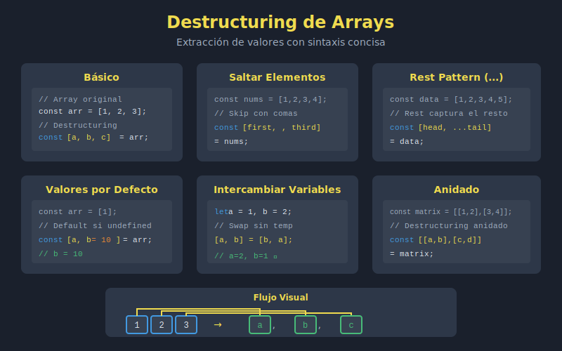
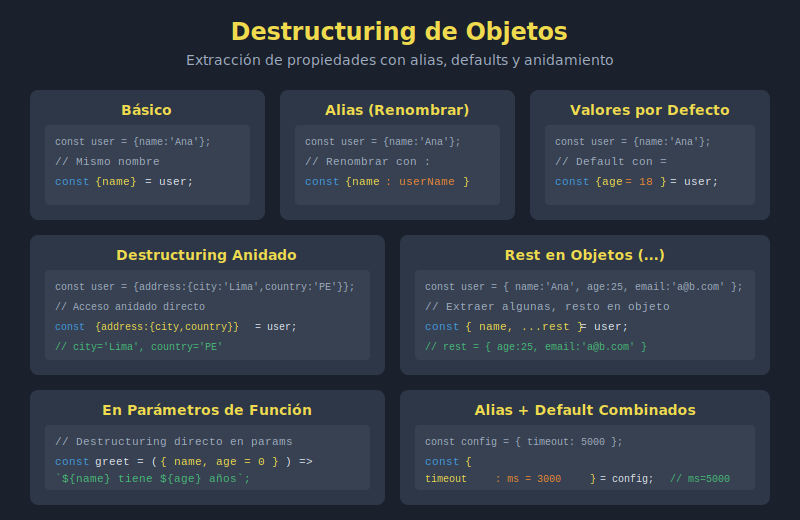

# 📁 Assets - Semana 4

## 📊 Recursos Visuales

Esta carpeta contiene los diagramas SVG para la **Semana 4: Destructuring y Módulos ES2023**.

---

## 🗂️ Archivos Incluidos

| # | Archivo | Descripción | Tema |
|---|---------|-------------|------|
| 1 | `01-destructuring-arrays.svg` | Extracción de valores en arrays | Skip, rest, defaults |
| 2 | `02-destructuring-objetos.svg` | Destructuring en objetos | Alias, anidado, params |
| 3 | `03-modulos-es6.svg` | Sistema de módulos ES2023 | import/export básico |
| 4 | `04-named-default-exports.svg` | Comparativa de exports | Named vs Default |
| 5 | `05-dynamic-imports.svg` | Carga dinámica de módulos | import(), lazy loading |

---

## 🎨 Estándares de Diseño

### Formato
- ✅ **SVG** para todos los diagramas
- ✅ **Tema dark** obligatorio
- ❌ **Sin degradados** (gradients)
- ✅ **Fuentes sans-serif** (system-ui, sans-serif)
- ✅ **Código en Courier/monospace**

### Dimensiones
- **ViewBox**: 800×400 a 800×600 píxeles
- **Responsive**: Escalan proporcionalmente

---

## 🎨 Paleta de Colores

| Color | Hex | Uso |
|-------|-----|-----|
| 🟡 Amarillo JS | `#f0db4f` | Acento principal, títulos destacados |
| ⬛ Fondo | `#1a202c` | Background principal |
| 🔲 Contenedor | `#2d3748` | Cajas y contenedores |
| 🔳 Código | `#374151` | Bloques de código |
| ⬜ Texto | `#e2e8f0` | Texto principal |
| 🔘 Texto Sec | `#a0aec0` | Texto secundario, comentarios |
| 🟢 Success | `#48bb78` | Correcto, export |
| 🔵 Info | `#4299e1` | Información, import |
| 🟠 Warning | `#ed8936` | Atención, default |
| 🔴 Error | `#ef4444` | Incorrecto, errores |
| 🟣 Accent | `#a78bfa` | Destacado adicional |

---

## 📖 Uso en Documentación

### Insertar en Markdown

```markdown



```

### Insertar en HTML

```html


<object data="0-assets/04-named-default-exports.svg" type="image/svg+xml"></object>
```

---

## ✅ Checklist de Assets

- [x] 01-destructuring-arrays.svg - Extracción en arrays
- [x] 02-destructuring-objetos.svg - Objetos y anidado
- [x] 03-modulos-es6.svg - Sistema de módulos
- [x] 04-named-default-exports.svg - Tipos de export
- [x] 05-dynamic-imports.svg - Carga dinámica

---

## 🔗 Referencias

- [SVG MDN Documentation](https://developer.mozilla.org/es/docs/Web/SVG)
- [JavaScript Modules](https://javascript.info/modules)
- [Semana 4 - Teoría](../1-teoria/)

---

_Última actualización: Semana 4 - Destructuring y Módulos ES2023_
