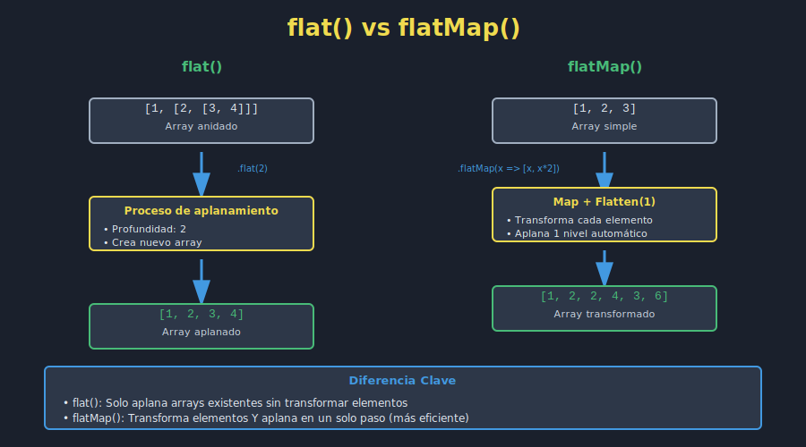

# 🎨 Assets Visuales - Semana 05

Diagramas y recursos visuales para complementar el material teórico de la semana de Arrays Avanzados.

---

## 📋 Lista de Assets

### 01. flat() vs flatMap()
**Archivo**: `01-flat-vs-flatmap.svg`
**Usado en**: [01-flat-flatmap.md](../1-teoria/01-flat-flatmap.md)
**Descripción**: Comparación lado a lado entre flat() que solo aplana y flatMap() que transforma + aplana.

**Conceptos visualizados**:
- Cómo funciona flat() con profundidad
- Cómo funciona flatMap() con transformación
- Diferencia en casos de uso
- Eficiencia de flatMap vs map + flat separados

---

### 02. Array.from() vs Array.of()
**Archivo**: `02-array-from-of.svg`
**Usado en**: [02-array-from-of.md](../1-teoria/02-array-from-of.md)
**Descripción**: Comparación de métodos de conversión y creación de arrays.

**Conceptos visualizados**:
- Array.from() convierte iterables (NodeList, strings, objects)
- Array.of() crea arrays a partir de argumentos
- La diferencia crítica: Array(5) vs Array.of(5)
- Mapeo simultáneo en conversión
- Casos de uso reales

---

### 03. Comparador en sort()
**Archivo**: `03-sort-comparator.svg`
**Usado en**: [03-sort-avanzado.md](../1-teoria/03-sort-avanzado.md)
**Descripción**: Visualización de cómo funcionan las funciones comparadoras en sort().

**Conceptos visualizados**:
- Ordenamiento numérico ascendente/descendente
- Ordenamiento alfabético con localeCompare
- Ordenamiento multi-criterio de objetos
- Función comparadora paso a paso
- Importancia de copiar antes de sort (mutabilidad)

---

### 04. Method Chaining (Encadenamiento)
**Archivo**: `04-method-chaining.svg`
**Usado en**: [04-chaining-complejo.md](../1-teoria/04-chaining-complejo.md)
**Descripción**: Flujo paso a paso de un ejemplo complejo de encadenamiento de métodos.

**Conceptos visualizados**:
- Cada método retorna un nuevo array
- Flujo de datos a través de filter → map → sort → slice
- Cómo se transforma la data en cada paso
- Legibilidad vs rendimiento
- Técnicas de debugging en cadenas

---

### 05. Transformaciones Avanzadas
**Archivo**: `05-transformations.svg`
**Usado en**: [05-transformaciones-datos.md](../1-teoria/05-transformaciones-datos.md)
**Descripción**: Visualización de patrones avanzados de transformación de datos.

**Conceptos visualizados**:
1. Agrupación (Grouping) con reduce()
2. Agregación (Aggregation) para estadísticas
3. Normalización (Normalization) de datos
4. Pivoteo (Pivoting) rows → columns
- Pipeline completo que combina múltiples transformaciones

---

### 06. Pipeline del Dashboard
**Archivo**: `06-dashboard-pipeline.svg`
**Usado en**: [3-proyecto/README.md](../3-proyecto/README.md)
**Descripción**: Flujo completo de procesamiento de datos en el dashboard.

**Conceptos visualizados**:
- Carga y validación de datos
- Aplicación de filtros
- Ordenamiento de resultados
- Paginación
- Formateo y renderizado
- Todos los métodos array utilizados en el proyecto

---

## 🎨 Estándares de Diseño

Todos los assets SVG siguen estos estándares:

### Colores
- **Background**: `#1a202c` (dark theme)
- **Texto principal**: `#e2e8f0` (gris claro)
- **Texto secundario**: `#a0aec0` (gris medio)
- **Accent JavaScript**: `#f0db4f` (amarillo JavaScript)
- **Success/Modern**: `#48bb78` (verde)
- **Error/Legacy**: `#ef4444` (rojo)
- **Info**: `#4299e1` (azul)
- **Accent**: `#a78bfa` (púrpura)

### Tipografía
- **Fuente principal**: `system-ui, sans-serif`
- **Fuente código**: `Courier, monospace`
- **Sin degradados**: Colores sólidos únicamente

### Dimensiones
- **Viewbox estándar**: 800x400 a 900x600 (según complejidad)
- **Formato**: SVG optimizado
- **Responsive**: Escalable sin pérdida de calidad

---

## 💡 Uso en Markdown

Para incluir un asset en un archivo de teoría:

```markdown

```

**Ejemplo**:
```markdown

```

---

## 📝 Convenciones de Nomenclatura

```
XX-descripcion-clara.svg
│  └── Descripción en kebab-case
└── Número secuencial (01, 02, 03...)
```

**Reglas**:
- Numerar en orden lógico de aprendizaje
- Usar kebab-case para nombres
- Nombres descriptivos y claros
- Prefijo numérico para orden

---

## ✅ Checklist para Assets Completados

- [x] 01-flat-vs-flatmap.svg - Comparación flat/flatMap
- [x] 02-array-from-of.svg - Conversión y creación de arrays
- [x] 03-sort-comparator.svg - Funciones comparadoras
- [x] 04-method-chaining.svg - Encadenamiento de métodos
- [x] 05-transformations.svg - Transformaciones avanzadas
- [x] 06-dashboard-pipeline.svg - Pipeline del proyecto

---

_Última actualización: Diciembre 2025_
_Versión: 1.0_
