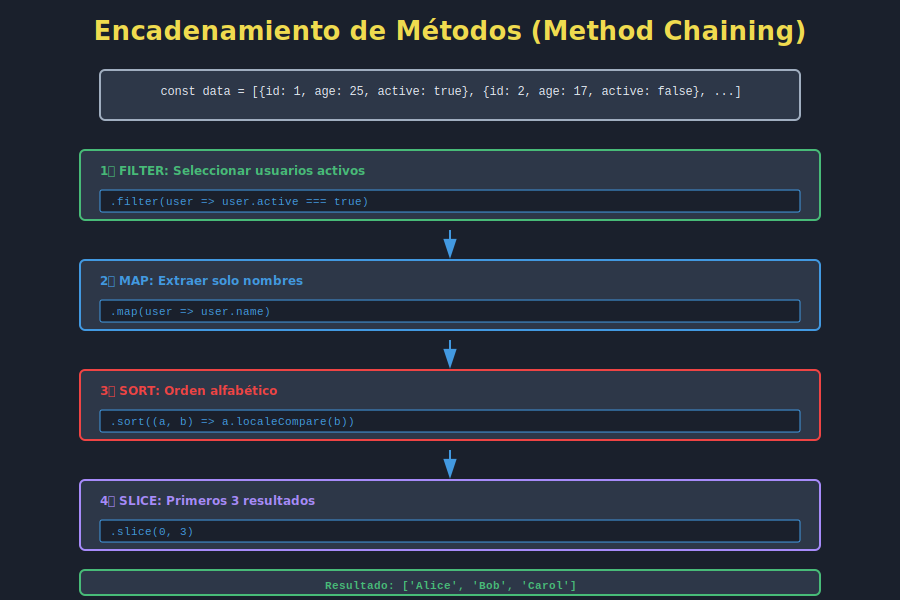

# ⛓️ Chaining Complejo: Encadenamiento de Métodos

## 🎯 Objetivos

En esta lección aprenderás a:
- ✅ Encadenar múltiples métodos de array efectivamente
- ✅ Entender el flujo de datos a través de chains
- ✅ Escribir chains legibles y mantenibles
- ✅ Debuggear chains complejos
- ✅ Optimizar rendimiento de chains



## 📋 Contenido

### 1. ¿Qué es Chaining?

**Chaining** es la técnica de llamar múltiples métodos consecutivamente, donde cada método retorna un valor que se usa como input del siguiente.

```javascript
// Ejemplo simple
const numbers = [1, 2, 3, 4, 5];

// Sin chaining - paso a paso
const doubled = numbers.map(n => n * 2);
const filtered = doubled.filter(n => n > 5);
const sorted = filtered.sort((a, b) => a - b);
const result = sorted.join(', ');
console.log(result);
// '6, 8, 10'

// Con chaining - elegante y fluido
const result2 = numbers
  .map(n => n * 2)
  .filter(n => n > 5)
  .sort((a, b) => a - b)
  .join(', ');
console.log(result2);
// '6, 8, 10'
```

### 2. Fundamentos del Chaining

#### Requisito: El Método Retorna un Valor

Los métodos de array que retornan arrays o valores primitivos pueden encadenarse:

```javascript
// ✅ Estos retornan arrays, se pueden encadenar
.map()          // Retorna array
.filter()       // Retorna array
.sort()         // Retorna array
.reverse()      // Retorna array
.slice()        // Retorna array
.flat()         // Retorna array
.flatMap()      // Retorna array

// ✅ Estos retornan primitivos (final de chain)
.join()         // Retorna string
.reduce()       // Retorna valor único
.find()         // Retorna elemento
.includes()     // Retorna booleano
```

```javascript
// ❌ Estos no retornan nada útil para chaining
.forEach()      // Retorna undefined
.some()         // Retorna booleano
.every()        // Retorna booleano
```

### 3. Patterns de Chaining Comunes

#### Pattern 1: Filtro → Transformación

```javascript
const users = [
  { name: 'Ana', age: 28, active: true },
  { name: 'Bob', age: 25, active: false },
  { name: 'Carlos', age: 32, active: true }
];

// Filtrar activos, luego extraer nombres
const activeNames = users
  .filter(user => user.active)
  .map(user => user.name);

console.log(activeNames);
// ['Ana', 'Carlos']
```

#### Pattern 2: Transformación → Ordenamiento → Extracción

```javascript
const products = [
  { name: 'Laptop', price: 999 },
  { name: 'Mouse', price: 25 },
  { name: 'Keyboard', price: 75 }
];

// Aplicar descuento, ordenar, obtener top 2
const topProducts = products
  .map(p => ({ ...p, discountedPrice: p.price * 0.9 }))
  .sort((a, b) => b.discountedPrice - a.discountedPrice)
  .slice(0, 2)
  .map(p => p.name)
  .join(' & ');

console.log(topProducts);
// 'Laptop & Keyboard'
```

#### Pattern 3: Aplanamiento → Filtro → Transformación

```javascript
const orders = [
  { id: 1, items: [{ id: 10, quantity: 2 }, { id: 11, quantity: 1 }] },
  { id: 2, items: [{ id: 12, quantity: 3 }] }
];

// Extraer todos los items, filtrar cantidad > 1, obtener IDs
const bulkItems = orders
  .flatMap(order => order.items)
  .filter(item => item.quantity > 1)
  .map(item => item.id);

console.log(bulkItems);
// [10, 12]
```

### 4. Escribir Chains Legibles

#### Indentación y Formato

```javascript
// ❌ Difícil de leer
const result = numbers.map(n => n * 2).filter(n => n > 5).sort((a, b) => a - b).join(', ');

// ✅ Legible
const result = numbers
  .map(n => n * 2)
  .filter(n => n > 5)
  .sort((a, b) => a - b)
  .join(', ');
```

#### Variables Intermedias para Claridad

Cuando el chain es MUY largo, usar variables intermedias:

```javascript
// Muy largo - difícil de seguir
const processed = data
  .filter(...)
  .map(...)
  .sort(...)
  .reduce(...)
  .map(...)
  .filter(...)
  .map(...);

// Mejor - dividir en pasos lógicos
const filtered = data.filter(condition);
const transformed = filtered.map(transform);
const sorted = transformed.sort(compareFn);
const aggregated = sorted.reduce(reducer);
const processed = aggregated.map(finalTransform);
```

#### Nombres Significativos

```javascript
// ❌ Confuso
const r = data.filter(x => x.a > 5).map(x => x.b);

// ✅ Claro
const highValueItems = data.filter(item => item.amount > 5);
const itemNames = highValueItems.map(item => item.name);
```

### 5. Debugging de Chains

#### Técnica 1: Insertar console.log()

```javascript
const result = data
  .filter(item => item.active)
  .map(item => {
    console.log('Después de filter:', item);
    return item.name;
  })
  .filter(name => name.length > 3)
  .map(name => {
    console.log('Nombre final:', name);
    return name.toUpperCase();
  });
```

#### Técnica 2: Función Helper para Debug

```javascript
// Crear función helper
const debug = (label, value) => {
  console.log(`[${label}]`, value);
  return value;
};

// Usar en chain
const result = data
  .filter(item => item.active)
  .map(debug.bind(null, 'Filtered'))
  .map(item => item.name)
  .map(debug.bind(null, 'Names'))
  .sort();
```

#### Técnica 3: Tap Function (Advanced)

```javascript
// Función tap que no modifica los datos
const tap = (fn) => (value) => {
  fn(value);
  return value;
};

const result = data
  .map(item => item.name)
  .map(tap(console.log))  // Ver qué pasa aquí
  .filter(name => name.length > 3);
```

### 6. Optimización de Chains

#### Problema: Múltiples Iteraciones

```javascript
// ❌ Ineficiente - itera 4 veces
const result = array
  .map(fn1)      // iteración 1
  .map(fn2)      // iteración 2
  .filter(fn3)   // iteración 3
  .map(fn4);     // iteración 4
```

#### Solución: Combinar Operaciones

```javascript
// ✅ Eficiente - itera una sola vez
const result = array
  .map(item => fn4(fn3(fn2(fn1(item)))));
```

#### Pero... Legibilidad vs Performance

```javascript
// Trade-off: Legibilidad
const result = data
  .filter(item => item.active)
  .map(item => item.value)
  .sort();

// Trade-off: Performance
const result = data.reduce((acc, item) => {
  if (item.active) {
    acc.push(item.value);
  }
  return acc;
}, []).sort();

// En MAYORÍA de casos, prioritizar legibilidad
// JavaScript engines optimizan bien los chains
```

### 7. Casos de Uso del Mundo Real

#### Análisis de Datos

```javascript
const salesData = [
  { month: 'Jan', region: 'North', amount: 5000 },
  { month: 'Jan', region: 'South', amount: 3000 },
  { month: 'Feb', region: 'North', amount: 6000 }
];

const northernTrend = salesData
  .filter(sale => sale.region === 'North')
  .sort((a, b) => a.month.localeCompare(b.month))
  .map(sale => sale.amount)
  .reduce((sum, amount) => sum + amount, 0);

console.log(`Total Northern Sales: $${northernTrend}`);
```

#### Transformación de API Response

```javascript
const apiResponse = {
  data: [
    { userId: 1, name: 'Ana', posts: [{ id: 1, likes: 10 }, { id: 2, likes: 5 }] },
    { userId: 2, name: 'Bob', posts: [{ id: 3, likes: 20 }] }
  ]
};

const topPostsPerUser = apiResponse.data
  .map(user => ({
    user: user.name,
    totalLikes: user.posts.reduce((sum, post) => sum + post.likes, 0)
  }))
  .sort((a, b) => b.totalLikes - a.totalLikes)
  .slice(0, 5)
  .map(({ user, totalLikes }) => `${user}: ${totalLikes} likes`)
  .join('\n');

console.log(topPostsPerUser);
```

#### Búsqueda y Filtrado de UI

```javascript
const searchAndFilter = (items, searchTerm, minPrice, maxPrice) => {
  return items
    .filter(item =>
      item.name.toLowerCase().includes(searchTerm.toLowerCase())
    )
    .filter(item =>
      item.price >= minPrice && item.price <= maxPrice
    )
    .sort((a, b) => a.price - b.price)
    .map(item => ({
      ...item,
      displayPrice: `$${item.price.toFixed(2)}`
    }))
    .slice(0, 20);  // Top 20 resultados
};
```

### 8. Anti-Patterns a Evitar

#### ❌ Anti-pattern 1: Chain Innecesariamente Largo

```javascript
// MALO - Demasiado largo, divide en partes
const result = data
  .filter(...)
  .map(...)
  .filter(...)
  .map(...)
  .filter(...)
  .reduce(...);

// MEJOR - Dividir lógicamente
const step1 = data.filter(...).map(...);
const step2 = step1.filter(...).map(...);
const result = step2.filter(...).reduce(...);
```

#### ❌ Anti-pattern 2: Mutar dentro del Chain

```javascript
// MALO - Efectos secundarios
const result = data.map(item => {
  globalState.count++;  // Mutación
  return item;
});

// MEJOR - Puro
const result = data.map(item => item);
```

#### ❌ Anti-pattern 3: No Comentar Chains Complejos

```javascript
// MALO
const r = d.filter(x=>x.a>5).map(x=>x.b*2).reduce((s,x)=>s+x);

// MEJOR
// Obtener items con valor > 5, doblar sus cantidades, sumar total
const total = data
  .filter(item => item.value > 5)
  .map(item => item.quantity * 2)
  .reduce((sum, qty) => sum + qty, 0);
```

## ✅ Checklist de Verificación

Antes de continuar, asegúrate de:

- [ ] Entender qué métodos retornan arrays para chaining
- [ ] Escribir chains con indentación clara
- [ ] Debuggear chains con console.log
- [ ] Reconocer cuándo un chain es demasiado largo
- [ ] Dividir chains en pasos lógicos cuando sea necesario
- [ ] Entender el trade-off entre legibilidad y performance
- [ ] Aplicar chaining en casos reales

## 🔗 Recursos Adicionales

- [MDN: Method Chaining](https://developer.mozilla.org/en-US/docs/Glossary/Method_chaining)
- [JavaScript.info: Array methods](https://javascript.info/array-methods)
- [Functional Programming Patterns](https://javascript.info/function)

## 💡 Tips y Trucos

1. **Regla de oro**: Si no puedes entender en 3 segundos, divide el chain
2. **Usar destructuring** en maps para claridad:
   ```javascript
   data
     .map(({ name, age }) => ({ name, senior: age > 65 }))
   ```
3. **Combinar filter + map** en flatMap cuando elimines elementos:
   ```javascript
   data.flatMap(item => item.active ? [item.name] : [])
   ```

---

**Próximo tema**: [Transformaciones de Datos](05-transformaciones-datos.md)
