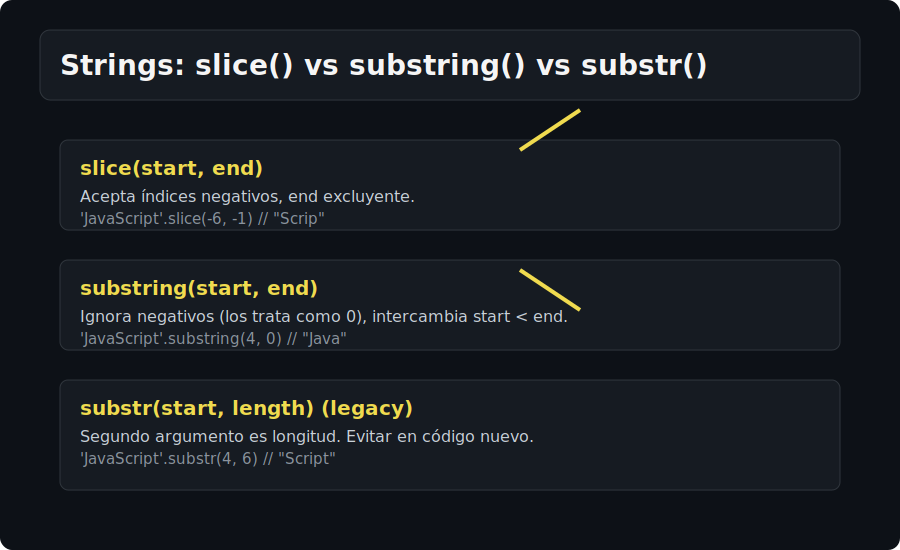

# Fundamentos de Strings

## 🎯 Objetivos
- Comprender representación de strings y longitud.
- Usar templates y escapes correctamente.
- Dominar slicing y comparaciones básicas.

## 📋 Contenido
### Representación y longitud
- Strings inmutables; length cuenta UTF-16 code units.
- Cuidado con emoji/surrogates: "💡".length === 2.

### Templates y concatenación
- Template literals para interpolación y multilínea.
- Evitar concatenación con + salvo casos simples.

### Slicing
- `slice(inicio, fin?)` (acepta índices negativos)
- `substring(inicio, fin?)` (intercambia si inicio > fin, no negativos)
- `substr(inicio, longitud?)` (legacy, evitar)

### Búsqueda y comparación
- `indexOf/lastIndexOf` (retornan -1 si no existe)
- `includes`, `startsWith`, `endsWith` (booleanos, más legibles)
- `localeCompare` para ordenamiento sensible a idioma

### Cambio de mayúsculas/minúsculas
- `toLowerCase`, `toUpperCase` (no mutan original)
- Para internacionalización avanzada, considerar `localeCompare` con locales.

## 🧠 Tips rápidos
- Usa template literals para claridad y expresividad.
- Prefiere `slice` frente a `substring` por soporte de negativos.
- `localeCompare` con opciones: `a.localeCompare(b, 'es', { sensitivity: 'base' })`.

## ✅ Checklist
- [ ] Uso de template literals dominado
- [ ] Diferencias slice vs substring claras
- [ ] Includes/startsWith/endsWith aplicados
- [ ] length entendido (UTF-16)
