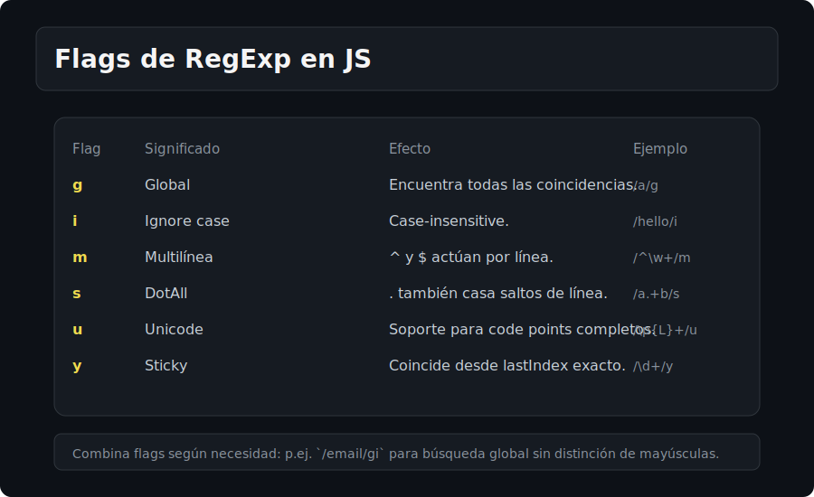

# RegExp Básico

## 🎯 Objetivos
- Crear expresiones regulares y aplicar flags.
- Usar test, exec, match, matchAll.

## 📋 Contenido
### Creación
- Literal: `/patron/flags`
- Constructor: `new RegExp('patron', 'gi')` (útil para dinámicos)

### Flags
- `g` global, `i` case-insensitive, `m` multiline, `s` dotAll, `u` unicode, `y` sticky
- Combinar: `/foo/gi`

### Métodos clave
- `regex.test(str)` → boolean
- `str.match(regex)` → array o null (comportamiento cambia con `g`)
- `str.matchAll(regexConG)` → iterador de coincidencias
- `regex.exec(str)` → detalle de coincidencia (avanza con `g`/`y`)
- `str.replace(regex, reemplazo)` / `replaceAll`

### Grupos y resultados
- `match` sin `g`: devuelve grupos
- `matchAll`: siempre iterator con grupos
- Índices: `result.index`, `result[0]` match completo, `result[1..n]` grupos

## ⚠️ Cuidados
- `matchAll` requiere flag `g`; en caso contrario lanza error.
- Con `g`, `match` no devuelve grupos; usa `matchAll`.
- Con `g` y `exec`, el lastIndex se mueve; reinicia o usa nuevo regex.

## ✅ Checklist
- [ ] Flags y combinaciones entendidas
- [ ] test/exec vs match/matchAll claros
- [ ] Uso de constructor para patrones dinámicos
