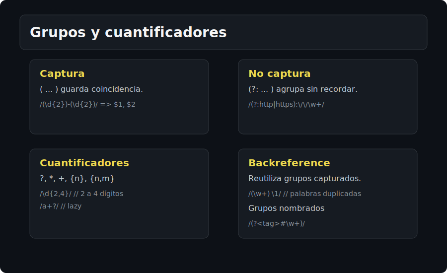

# Patrones y Grupos

## 🎯 Objetivos
- Dominar clases, cuantificadores, anclas, alternancia.
- Capturar, agrupar y usar backreferences.

## 📋 Contenido
### Clases de caracteres
- `[abc]`, `[a-z]`, `[^a-z]`
- Predefinidas: `\d`, `\w`, `\s`, y sus negadas `\D`, `\W`, `\S`

### Cuantificadores
- `?` opcional, `*` 0+, `+` 1+, `{n}`, `{n,}`, `{n,m}`
- Greedy vs lazy: `+` vs `+?`

### Anclas y límites
- `^` inicio, `$` fin (en multilinea dependen de `m`)
- `\b` boundary palabra, `\B` no-boundary

### Grupos
- Captura: `( ... )` accesible por índice o nombre
- No-captura: `(?: ... )`
- Nombrados: `(?<name> ... )` (ES2018)
- Alternancia: `foo|bar`
- Backreference: `\1`, `\k<name>`

## ⚠️ Cuidados
- Siempre escapa caracteres especiales cuando vengan de input de usuario.
- Usa cuantificadores precisos para evitar backtracking excesivo.
- Boundary `\b` depende de `\w`; no cuenta guiones.

## ✅ Checklist
- [ ] Uso de grupos nombrados y no-captura
- [ ] Alternancias claras y acotadas
- [ ] Cuantificadores específicos (evitar `.*` sin necesidad)
- [ ] Anclas y boundaries aplicadas correctamente
