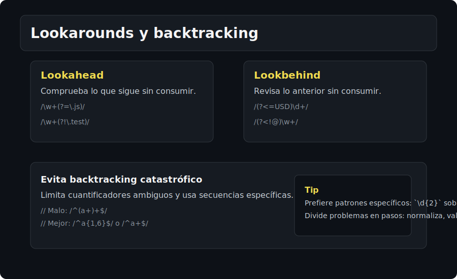

# RegExp Avanzado

## 🎯 Objetivos
- Aplicar lookahead/lookbehind, backreferences y boundaries.
- Evitar patrones inseguros y manejar errores.

## 📋 Contenido
### Lookarounds
- Lookahead positivo: `(?=patron)`
- Lookahead negativo: `(?!patron)`
- Lookbehind positivo: `(?<=patron)`
- Lookbehind negativo: `(?<!patron)`
- Útiles para validar contexto sin consumir caracteres.

### Backreferences y reemplazos
- Reutiliza grupos: `/(\w+)\s\1/`
- En replace: `$1`, `$<name>`

### Boundaries avanzadas
- `\b` para palabras; para guiones/emoji, considera alternativas específicas.
- `^`/`$` con `m` afectan cada línea; con `s`, `.` incluye saltos de línea.

### Seguridad y rendimiento
- Escapa input de usuario antes de interpolar en RegExp.
- Evita patrones con `.*` frente a `.*?` cuando aplique.
- Detecta backtracking excesivo: limita cuantificadores, anida menos.
- Maneja errores: `try { new RegExp(userPattern) } catch (err) { ... }`.

### Unicode y u-flag
- `\p{L}` con `u` para letras Unicode.
- `.` no captura saltos de línea salvo flag `s`.

## ⚠️ Cuidados
- Lookbehind no está en todos los entornos antiguos.
- Sticky `y` avanza desde lastIndex exacto; útil para parsers.

## ✅ Checklist
- [ ] Lookarounds aplicados sin consumir texto
- [ ] Escapado de input implementado
- [ ] Flags `u`, `s`, `y` entendidas
- [ ] Patrones revisados para evitar backtracking
