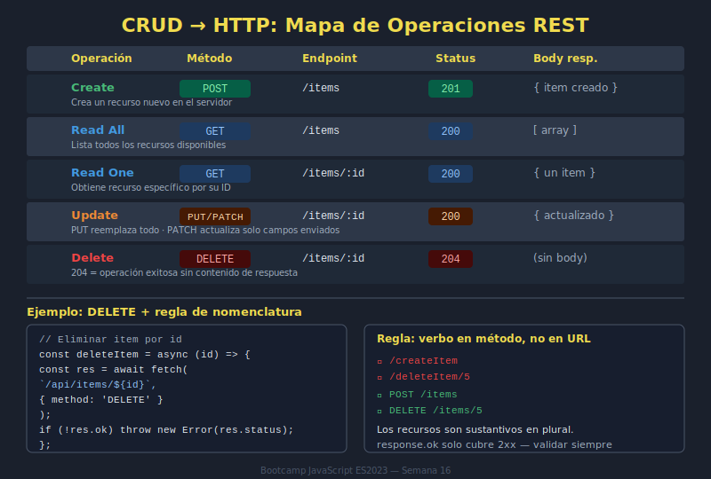

# 01. Fundamentos REST

## 🎯 Objetivos

- Comprender qué es una API REST
- Identificar recursos y rutas
- Diferenciar colección vs recurso individual
- Aplicar convenciones de URLs limpias

---

## 📌 ¿Qué significa REST?

REST (Representational State Transfer) es un estilo de arquitectura para diseñar APIs basadas en recursos.

- Un **recurso** es una entidad del dominio (por ejemplo: `books`, `orders`, `members`).
- Cada recurso tiene una URL representativa.
- La operación se define con método HTTP, no con verbos en la URL.

### 🖼️ Recurso visual de apoyo



Usa este diagrama para validar rápidamente si la combinación método + endpoint está bien planteada antes de implementar código.

### ✅ Buenas rutas REST

```text
GET /items
GET /items/42
POST /items
PATCH /items/42
DELETE /items/42
```

### ❌ Rutas poco RESTful

```text
GET /getItems
POST /createItem
POST /deleteItem?id=42
```

---

## 🧱 Colección y recurso individual

- `/items` representa la colección.
- `/items/:id` representa un elemento específico.

```javascript
const getCollection = () => fetch('/api/items');
const getById = itemId => fetch(`/api/items/${itemId}`);
```

---

## 🔎 Query parameters para filtros

Los filtros y paginación van en query params, no en la ruta.

```javascript
const params = new URLSearchParams({
  page: 1,
  limit: 10,
  search: 'lunar'
});

const response = await fetch(`/api/items?${params}`);
```

---

## ✅ Checklist rápido REST

- [ ] Nombres de recursos en plural
- [ ] Sin verbos en rutas
- [ ] CRUD expresado con métodos HTTP
- [ ] Filtros/paginación en query params
