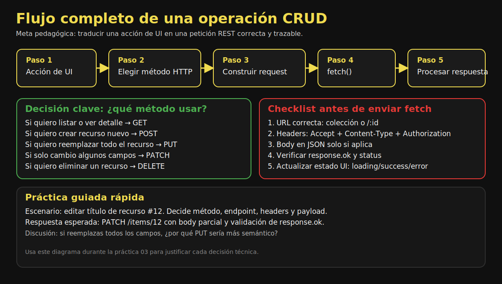

# 02. Métodos HTTP y CRUD

## 🎯 Objetivos

- Mapear CRUD con métodos HTTP
- Diferenciar PUT vs PATCH
- Interpretar códigos de estado comunes

---

## 🔁 Mapa CRUD

| CRUD | Método HTTP | Endpoint típico |
|------|-------------|-----------------|
| Create | POST | `/items` |
| Read | GET | `/items`, `/items/:id` |
| Update | PUT / PATCH | `/items/:id` |
| Delete | DELETE | `/items/:id` |

### 🖼️ Flujo visual de decisión HTTP



Revisa este flujo antes de cada práctica para decidir de forma consistente el método HTTP y la estructura de la petición.

---

## ✍️ POST (Create)

```javascript
const payload = { title: 'Nuevo elemento', body: 'Descripción' };

const response = await fetch('/api/items', {
  method: 'POST',
  headers: { 'Content-Type': 'application/json' },
  body: JSON.stringify(payload)
});
```

Respuesta esperada: `201 Created`.

---

## 🔄 PUT vs PATCH

- `PUT`: reemplazo completo del recurso.
- `PATCH`: actualización parcial.

```javascript
await fetch('/api/items/10', {
  method: 'PUT',
  headers: { 'Content-Type': 'application/json' },
  body: JSON.stringify({ title: 'Completo', body: 'Nuevo body', status: 'active' })
});

await fetch('/api/items/10', {
  method: 'PATCH',
  headers: { 'Content-Type': 'application/json' },
  body: JSON.stringify({ status: 'archived' })
});
```

---

## 🗑️ DELETE

```javascript
const response = await fetch('/api/items/10', { method: 'DELETE' });

if (response.status === 204) {
  console.log('Recurso eliminado');
}
```

---

## 📡 Status codes comunes

- `200 OK`: operación exitosa
- `201 Created`: creación exitosa
- `204 No Content`: eliminación o actualización sin body
- `400 Bad Request`: datos inválidos
- `401 Unauthorized`: token faltante/incorrecto
- `404 Not Found`: recurso inexistente
- `500 Internal Server Error`: error del servidor
