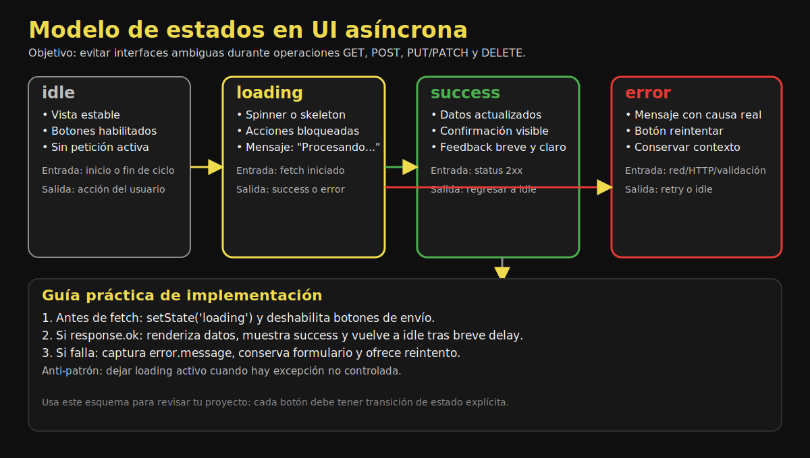

# 04. Estados de Carga y Manejo de Errores

## 🎯 Objetivos

- Modelar estados de interfaz para operaciones async
- Comunicar feedback claro al usuario
- Diferenciar errores de red y errores HTTP

---

## 🧭 Estados recomendados



Este recurso te ayuda a modelar transiciones entre estados y evitar interfaces que se quedan bloqueadas en `loading`.

```javascript
const uiState = {
  status: 'idle', // idle | loading | success | error
  message: ''
};
```

### Flujo básico

1. `loading`: inicia petición
2. `success`: respuesta correcta
3. `error`: petición fallida

---

## 🧪 Patrón try/catch/finally

```javascript
const loadItems = async () => {
  setStatus('loading', 'Cargando elementos...');

  try {
    const response = await fetch('/api/items');

    if (!response.ok) {
      throw new Error(`HTTP ${response.status}`);
    }

    const data = await response.json();
    renderItems(data);
    setStatus('success', 'Carga completada');

  } catch (error) {
    setStatus('error', `No se pudo cargar: ${error.message}`);

  } finally {
    toggleLoading(false);
  }
};
```

---

## 🧰 Funciones auxiliares sugeridas

```javascript
const setStatus = (status, message) => {
  // Actualiza estado global + UI
};

const toggleLoading = isLoading => {
  // Deshabilitar/habilitar botones mientras hay petición activa
};
```

---

## ✅ Recomendaciones UX

- Mostrar mensajes específicos por operación (crear, editar, eliminar).
- Deshabilitar acciones duplicadas mientras una petición está en curso.
- Incluir botón de reintento cuando falle la carga inicial.
- Mantener consistencia visual entre éxito y error.
