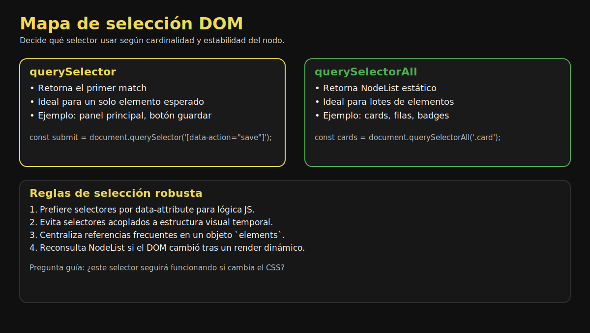

# 01. Selectores DOM Modernos

## 🎯 Objetivos

- Usar selectores precisos y mantenibles
- Diferenciar `querySelector` y `querySelectorAll`
- Evitar consultas redundantes al DOM

---

## 🧠 Idea central

El DOM es un árbol de nodos. Los selectores te permiten ubicar nodos de forma declarativa y legible.



---

## 🔎 `querySelector`

Retorna **el primer nodo** que coincide con el selector.

```javascript
const panel = document.querySelector('.panel');
const saveButton = document.querySelector('[data-action="save"]');
```

Úsalo cuando esperas un único elemento.

---

## 📚 `querySelectorAll`

Retorna un `NodeList` estático.

```javascript
const cards = document.querySelectorAll('.card');
cards.forEach(card => card.classList.add('is-visible'));
```

Si agregas nuevos nodos luego, necesitas consultar nuevamente o usar delegación de eventos.

---

## 🧩 Buenas prácticas de selección

- Preferir selectores por `data-*` para lógica de JS.
- Evitar selectores demasiado largos o frágiles.
- Guardar referencias usadas frecuentemente en un objeto `elements`.

```javascript
const elements = {
  list: document.querySelector('[data-ui="list"]'),
  form: document.querySelector('[data-ui="form"]'),
  submit: document.querySelector('[data-ui="submit"]')
};
```

---

## ⚠️ Errores comunes

- Asumir que `querySelectorAll` devuelve un array real.
- Hacer `querySelector` dentro de loops sin necesidad.
- Usar IDs duplicados en HTML.

---

## ✅ Checklist

- [ ] Seleccioné nodos con selectores estables
- [ ] Evité búsquedas repetitivas
- [ ] Diferencié claramente selección única vs múltiple
