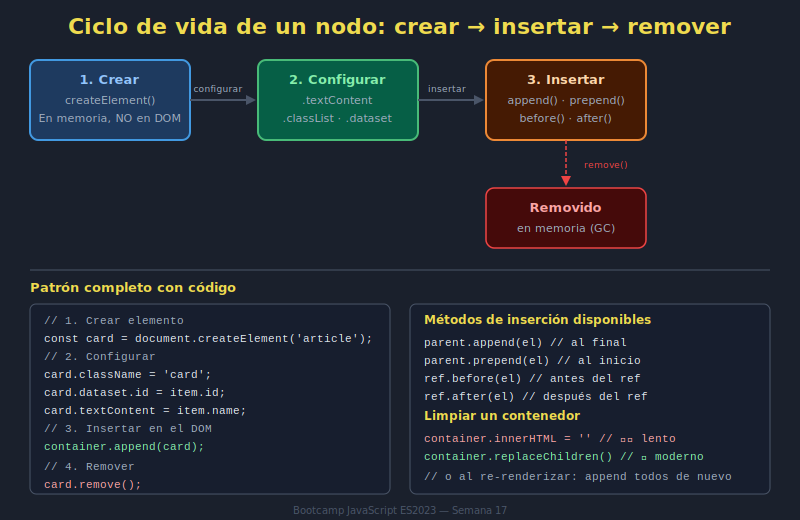

# 02. Crear, Insertar y Remover Nodos

## 🎯 Objetivos

- Crear nodos con `createElement`
- Insertar nodos en posiciones específicas
- Remover nodos de forma segura

---

## 🧠 Ciclo de vida de un nodo

1. Crear (`createElement`)
2. Configurar (texto, atributos, clases)
3. Insertar (`append`, `prepend`, `before`, `after`)
4. Remover (`remove`)



---

## 🏗️ Crear nodos

```javascript
const card = document.createElement('article');
card.className = 'card';
card.textContent = 'Tarjeta creada dinámicamente';
```

`createElement` no renderiza nada hasta que insertes el nodo en el árbol.

---

## 📍 Insertar nodos

```javascript
const list = document.querySelector('[data-ui="list"]');

list.append(card);      // al final
list.prepend(card);     // al inicio
```

Otros métodos útiles:

- `element.before(node)`
- `element.after(node)`
- `parent.replaceChildren(...nodes)`

---

## 🧹 Remover nodos

```javascript
const item = document.querySelector('[data-id="42"]');
item?.remove();
```

Usar optional chaining evita errores cuando el nodo no existe.

---

## ⚡ Rendimiento básico

- Construir nodos fuera del árbol y luego insertar.
- Agrupar cambios cuando sea posible.
- Evitar limpiar y rehacer toda la vista en cada interacción.

---

## ⚠️ Errores comunes

- Insertar el mismo nodo en múltiples lugares (se mueve, no se clona).
- Usar `innerHTML += ...` en loops grandes.
- Eliminar nodos sin actualizar estado en memoria.

---

## ✅ Checklist

- [ ] Creo nodos de forma explícita
- [ ] Inserto en posición correcta
- [ ] Remuevo sin dejar referencias obsoletas
