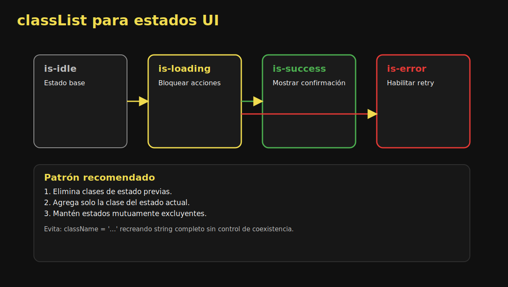

# 03. classList y Estados Visuales

## 🎯 Objetivos

- Manipular clases CSS sin concatenar strings
- Modelar estados de interfaz con clases semánticas
- Mantener consistencia visual durante interacciones

---

## 🧠 Por qué `classList`

`classList` ofrece una API segura y expresiva para agregar, remover y alternar clases.



---

## 🛠️ Métodos principales

```javascript
const card = document.querySelector('.card');

card.classList.add('is-selected');
card.classList.remove('is-hidden');
card.classList.toggle('is-expanded');
```

También puedes evaluar existencia:

```javascript
if (card.classList.contains('is-selected')) {
  console.log('Tarjeta activa');
}
```

---

## 🧩 Patrón de estado UI

Define clases por estado:

- `is-loading`
- `is-success`
- `is-error`

```javascript
const setStatusClass = (element, status) => {
  element.classList.remove('is-loading', 'is-success', 'is-error');
  element.classList.add(`is-${status}`);
};
```

---

## ✅ Ventajas

- Código más legible
- Menos errores que editar `className` manualmente
- Fácil de testear y depurar

---

## ⚠️ Errores comunes

- Acumular clases de estado sin limpiar previas.
- Usar clases visuales como lógica de negocio.
- Cambiar clases en múltiples lugares sin función centralizada.

---

## ✅ Checklist

- [ ] Uso `classList` en vez de manipular strings
- [ ] Mis estados visuales son exclusivos y claros
- [ ] Centralizo cambios de clase en funciones reutilizables
