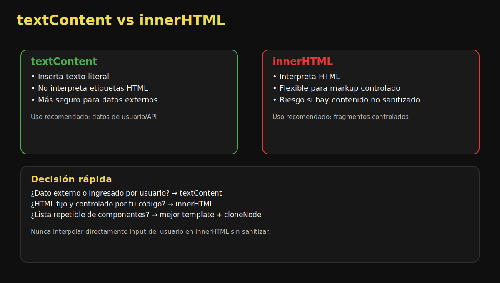
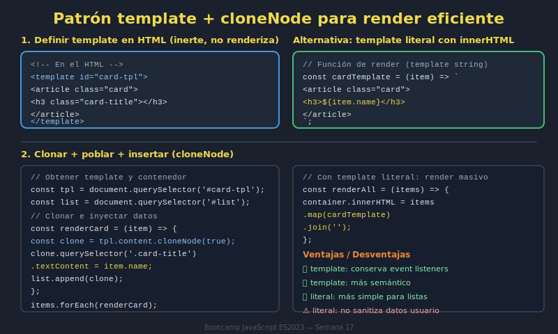

# 04. textContent, innerHTML y Template

## 🎯 Objetivos

- Elegir entre `textContent` e `innerHTML` según contexto
- Entender implicaciones de seguridad básicas
- Reutilizar estructura con `<template>`

---

## 🧠 `textContent` vs `innerHTML`



- `textContent`: inserta texto literal, más seguro para datos externos.
- `innerHTML`: interpreta HTML, útil para markup controlado.

```javascript
titleElement.textContent = userInput;
```

```javascript
container.innerHTML = '<strong>Contenido controlado</strong>';
```

---

## 🔐 Nota de seguridad

Si los datos vienen del usuario o de fuentes externas, evita interpolarlos en `innerHTML` sin sanitización.

---

## 🧩 `<template>` para render reutilizable

El elemento `<template>` no se renderiza por sí mismo. Se clona su contenido cuando lo necesitas.



```html
<template id="cardTemplate">
  <article class="card">
    <h3 data-field="title"></h3>
    <p data-field="description"></p>
  </article>
</template>
```

```javascript
const template = document.querySelector('#cardTemplate');
const fragment = template.content.cloneNode(true);

fragment.querySelector('[data-field="title"]').textContent = item.title;
fragment.querySelector('[data-field="description"]').textContent = item.description;

list.append(fragment);
```

---

## ✅ Cuándo usar cada enfoque

- Texto dinámico externo: `textContent`
- HTML estático controlado: `innerHTML`
- Componentes repetibles: `<template>` + `cloneNode`

---

## ⚠️ Errores comunes

- Usar `innerHTML` para todo por comodidad.
- Clonar template sin actualizar campos dinámicos.
- Renderizar listas sin limpiar estado previo.

---

## ✅ Checklist

- [ ] Uso `textContent` para datos dinámicos
- [ ] Uso `innerHTML` solo cuando corresponde
- [ ] Renderizo tarjetas reutilizables con `<template>`
