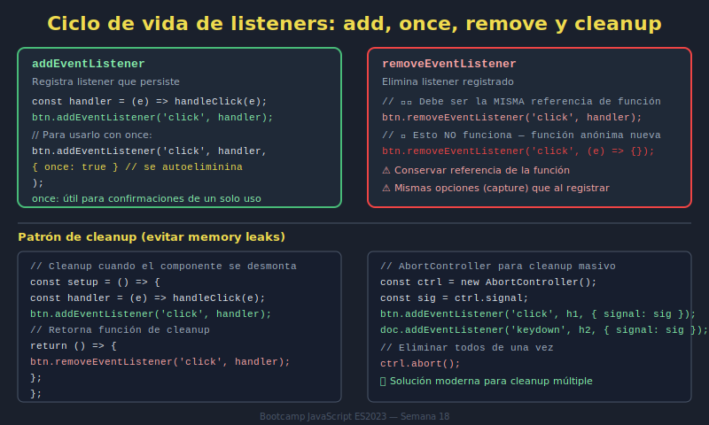

# 01. addEventListener y removeEventListener

## 🎯 Objetivos

- Registrar listeners de forma explícita y mantenible
- Remover listeners para evitar comportamientos duplicados
- Entender el ciclo de vida de listeners en UI dinámica

---

## 🧠 Fundamento

Un listener conecta un evento con una función callback.

```javascript
button.addEventListener('click', handleClick);
```

Si la UI se monta y desmonta, debes quitar listeners cuando ya no se necesitan.

```javascript
button.removeEventListener('click', handleClick);
```

---

## 🖼️ Recurso visual



### Actividad guiada (10 min)

1. Explica con el diagrama en qué momento se registra y se remueve cada listener.
2. Predice qué pasa si se monta el componente dos veces sin cleanup.
3. Verifica la hipótesis con logs en consola.

---

## 🧩 Patrón recomendado

```javascript
const registerListeners = () => {
  button.addEventListener('click', handleClick);
  form.addEventListener('submit', handleSubmit);
};

const unregisterListeners = () => {
  button.removeEventListener('click', handleClick);
  form.removeEventListener('submit', handleSubmit);
};
```

Mantén pares claros: si registras, define también cómo desregistrar.

---

## ⚠️ Errores comunes

- Registrar el mismo listener varias veces.
- Usar funciones anónimas que luego no puedes remover.
- No limpiar listeners al destruir componentes.

---

## ✅ Buenas prácticas

- Reutiliza referencias de callbacks (`const handleClick = () => {}`)
- Agrupa registro/remoción en funciones claras
- Documenta cuándo se llama cada etapa

---

## ✅ Checklist

- [ ] Cada listener tiene callback con referencia estable
- [ ] Existe función de limpieza de listeners
- [ ] Evito registro duplicado accidental
