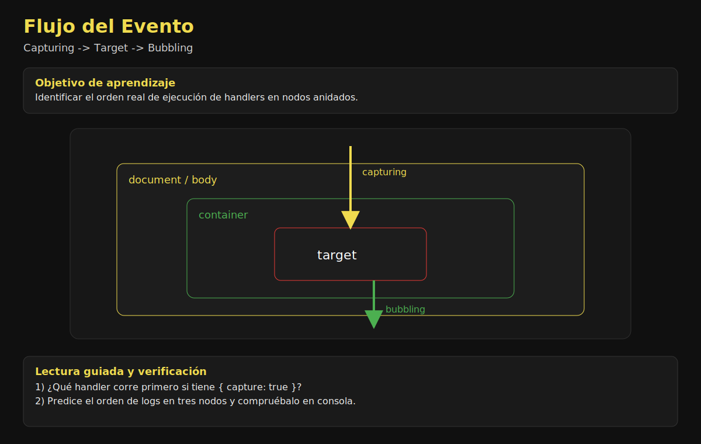

# 02. Bubbling y Capturing

## 🎯 Objetivos

- Diferenciar fase de captura y fase de burbujeo
- Controlar en qué fase escuchar un evento
- Entender el orden de ejecución en nodos anidados

---

## 🌊 Flujo de propagación

Cuando ocurre un evento en un nodo interno:

1. **Capturing**: baja desde `document` al objetivo.
2. **Target**: llega al elemento objetivo.
3. **Bubbling**: sube desde objetivo hacia ancestros.



### Actividad guiada (10 min)

1. Pide al grupo ordenar las fases del evento según el diagrama.
2. Pregunta cuándo corre un listener con `{ capture: true }`.
3. Valida la respuesta con una demo de logs en tres nodos anidados.

---

## 🧪 Ejemplo básico

```javascript
parent.addEventListener('click', () => {
  console.log('Parent bubbling');
});

parent.addEventListener('click', () => {
  console.log('Parent capturing');
}, { capture: true });
```

---

## 🎛️ ¿Cuándo usar capture?

Usa `capture: true` cuando necesitas interceptar temprano antes de que el evento llegue al objetivo o a otros handlers de bubbling.

---

## ⚠️ Errores comunes

- Creer que todos los eventos burbujean igual.
- Mezclar handlers de captura y bubbling sin intención.
- Usar `stopPropagation` para tapar problemas de arquitectura.

---

## ✅ Recomendaciones

- Define explícitamente si un listener usa captura.
- Documenta eventos críticos que dependan del orden.
- Usa logs temporales para visualizar el flujo en debugging.

---

## ✅ Checklist

- [ ] Sé en qué fase escucha cada handler
- [ ] Entiendo orden de ejecución en el árbol DOM
- [ ] Evito depender de propagación implícita no documentada
