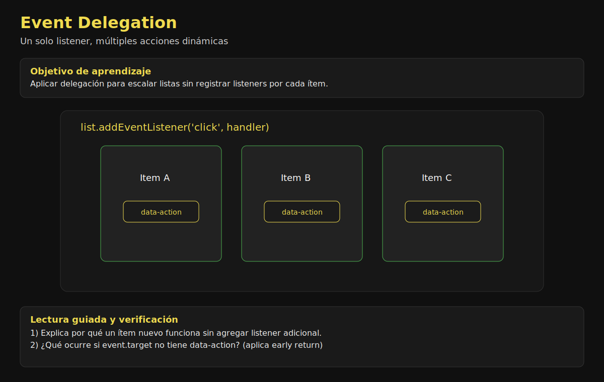

# 03. Event Delegation

## 🎯 Objetivos

- Implementar delegación para listas dinámicas
- Reducir cantidad de listeners en UIs complejas
- Resolver acciones por `event.target` y `closest`

---

## 🧠 Qué es delegación de eventos

Consiste en registrar **un solo listener** en un contenedor padre y resolver internamente qué hijo disparó la interacción.



### Actividad guiada (10 min)

1. Compara listeners individuales vs listener delegado único.
2. Simula clics en targets válidos e inválidos.
3. Explica por qué la delegación funciona con elementos dinámicos.

---

## 🧪 Ejemplo práctico

```javascript
list.addEventListener('click', event => {
  const actionButton = event.target.closest('[data-action]');
  if (!actionButton) return;

  const action = actionButton.dataset.action;
  const itemElement = actionButton.closest('[data-item-id]');
  const itemId = Number(itemElement?.dataset.itemId);

  if (action === 'remove') removeItem(itemId);
  if (action === 'feature') featureItem(itemId);
});
```

---

## ✅ Ventajas

- Mejor rendimiento en listas grandes
- Soporte inmediato para elementos agregados dinámicamente
- Menor complejidad de registro/remoción de listeners

---

## ⚠️ Errores comunes

- No filtrar correctamente target y ejecutar acciones equivocadas.
- Asumir estructura del DOM sin validar `closest`.
- Mezclar delegación y listeners individuales sin criterio.

---

## ✅ Buenas prácticas

- Usa `data-action` y `data-item-id` para decisiones.
- Encapsula el handler delegado en una función dedicada.
- Maneja acciones inválidas con early return.

---

## ✅ Checklist

- [ ] Uso un solo listener en el contenedor principal
- [ ] Identifico acción y entidad con data-attributes
- [ ] Soporto elementos creados dinámicamente
