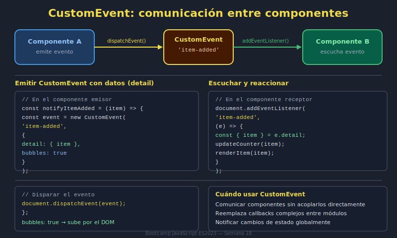
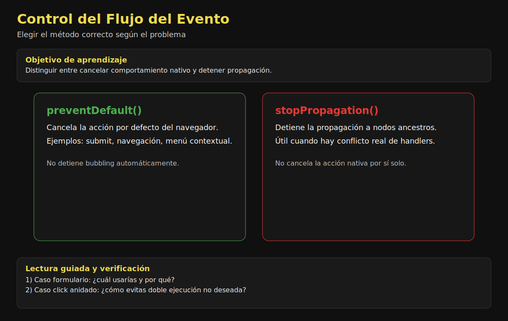

# 04. CustomEvent, preventDefault y stopPropagation

## 🎯 Objetivos

- Crear eventos personalizados con payload
- Comunicar módulos desacoplados de UI
- Controlar flujo con `preventDefault` y `stopPropagation`

---

## 🧩 CustomEvent

`CustomEvent` permite emitir eventos semánticos propios de tu aplicación.



### Actividad guiada (12 min)

1. Define una convención de eventos de dominio (ej. `notification:created`).
2. Diseña un `detail` mínimo y consistente.
3. Comprueba en consola que productor y consumidor quedan desacoplados.

```javascript
const event = new CustomEvent('notification:create', {
  detail: { title: 'Guardado', level: 'success' }
});

document.dispatchEvent(event);
```

Y lo escuchas así:

```javascript
document.addEventListener('notification:create', event => {
  console.log('Detalle:', event.detail);
});
```

---

## 🚫 preventDefault

Evita comportamiento nativo del navegador.

```javascript
form.addEventListener('submit', event => {
  event.preventDefault();
  saveData();
});
```

---

## 🛑 stopPropagation

Detiene la propagación del evento hacia otros ancestros.

```javascript
button.addEventListener('click', event => {
  event.stopPropagation();
});
```

Úsalo con criterio, no como parche general.



### Actividad guiada (8 min)

1. Presenta dos casos: submit y click anidado.
2. Decide si corresponde `preventDefault` o `stopPropagation`.
3. Justifica técnicamente la decisión y valida con prueba rápida.

---

## ⚠️ Errores comunes

- Emitir CustomEvent sin convención de nombres clara.
- Usar `stopPropagation` indiscriminadamente.
- Bloquear comportamiento nativo sin proveer alternativa UX.

---

## ✅ Checklist

- [ ] Mis CustomEvent tienen nombre y payload claros
- [ ] Uso preventDefault solo cuando hay intención explícita
- [ ] stopPropagation está justificado y documentado
