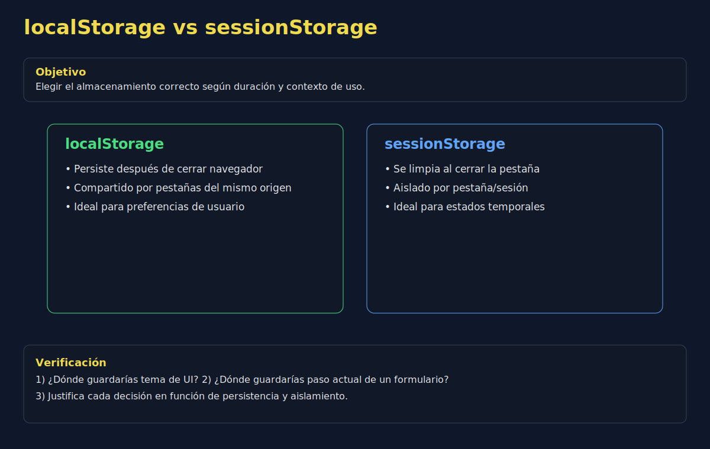

# 01. localStorage y sessionStorage

## 🎯 Objetivos

- Diferenciar alcance y duración entre `localStorage` y `sessionStorage`
- Implementar operaciones de lectura/escritura de forma segura
- Diseñar claves de almacenamiento consistentes

---

## 🧠 Fundamento

`localStorage` persiste datos sin fecha de expiración (hasta limpieza manual o del navegador).

`sessionStorage` persiste datos solo durante la sesión/pestaña actual.

```javascript
localStorage.setItem('theme', 'dark');
const theme = localStorage.getItem('theme');
```

```javascript
sessionStorage.setItem('wizard-step', '2');
const step = sessionStorage.getItem('wizard-step');
```

---

## 🖼️ Recurso visual



### Actividad guiada (10 min)

1. Clasifica datos de ejemplo: preferencia de idioma, carrito temporal, token efímero.
2. Decide en qué storage guardar cada dato.
3. Justifica la decisión según duración y alcance.

---

## ✅ Buenas prácticas

- Usa prefijos por módulo, por ejemplo: `app:settings:theme`
- Centraliza acceso en funciones utilitarias
- Valida `null` al leer claves inexistentes

---

## ⚠️ Errores comunes

- Guardar objetos sin serializar
- Usar sessionStorage para datos que deben sobrevivir reinicio
- Mezclar claves sin convención

---

## ✅ Checklist

- [ ] Distingo casos de uso de localStorage y sessionStorage
- [ ] Implemento lectura/escritura con validaciones básicas
- [ ] Uso convención de nombres para claves
