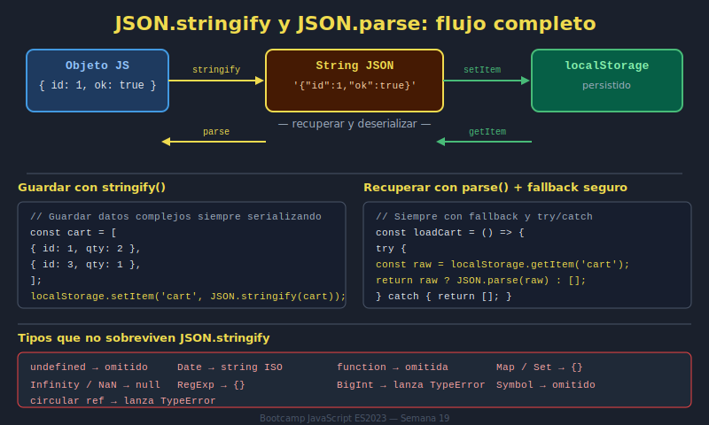

# 02. Serialización JSON

## 🎯 Objetivos

- Convertir estructuras a string con `JSON.stringify`
- Recuperar estructuras con `JSON.parse`
- Manejar fallos de parseo sin romper la aplicación

---

## 🧠 Fundamento

Web Storage solo guarda strings. Para persistir arrays u objetos, debes serializar.

```javascript
const state = { filters: ['active'], page: 1 };
localStorage.setItem('app:state', JSON.stringify(state));
```

```javascript
const raw = localStorage.getItem('app:state');
const parsed = raw ? JSON.parse(raw) : { filters: [], page: 1 };
```

---

## 🖼️ Recurso visual



### Actividad guiada (10 min)

1. Guarda un objeto con anidamiento básico en localStorage.
2. Fuerza un dato inválido y observa error de parseo.
3. Implementa fallback por defecto en un helper.

---

## 🧩 Patrón recomendado

```javascript
const safeParse = (value, fallback) => {
  try {
    return value ? JSON.parse(value) : fallback;
  } catch {
    return fallback;
  }
};
```

---

## ⚠️ Errores comunes

- Llamar `JSON.parse` sobre `null` sin fallback
- No capturar excepciones por JSON corrupto
- Guardar estructuras demasiado grandes sin control

---

## ✅ Checklist

- [ ] Uso stringify/parse correctamente
- [ ] Manejo errores de parseo con fallback
- [ ] Mantengo una estructura de datos estable
