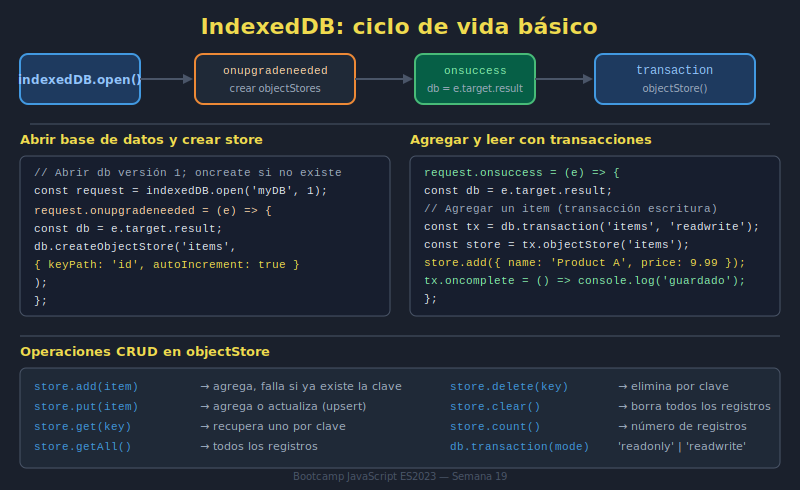

# 03. IndexedDB básico

## 🎯 Objetivos

- Entender cuándo usar IndexedDB en lugar de Web Storage
- Abrir una base de datos y crear object stores
- Ejecutar operaciones CRUD básicas

---

## 🧠 Fundamento

IndexedDB permite almacenar volúmenes mayores y estructuras más complejas de manera asíncrona.

```javascript
const request = indexedDB.open('bootcamp-db', 1);

request.onupgradeneeded = event => {
  const db = event.target.result;
  if (!db.objectStoreNames.contains('items')) {
    db.createObjectStore('items', { keyPath: 'id' });
  }
};
```

---

## 🖼️ Recurso visual



### Actividad guiada (12 min)

1. Abre una DB y crea store `items`.
2. Inserta un registro con `put`.
3. Recupera el registro por clave y muestra resultado en consola.

---

## ✅ Buenas prácticas

- Versiona la base de datos (`open(name, version)`)
- Usa stores por entidad principal
- Maneja `onerror` en requests y transacciones

---

## ⚠️ Errores comunes

- No controlar `onupgradeneeded`
- Olvidar `keyPath` para entidades
- Asumir flujo síncrono en operaciones IndexedDB

---

## ✅ Checklist

- [ ] Abro y versiono la base de datos
- [ ] Creo object stores de forma correcta
- [ ] Leo/escribo datos con manejo de errores
