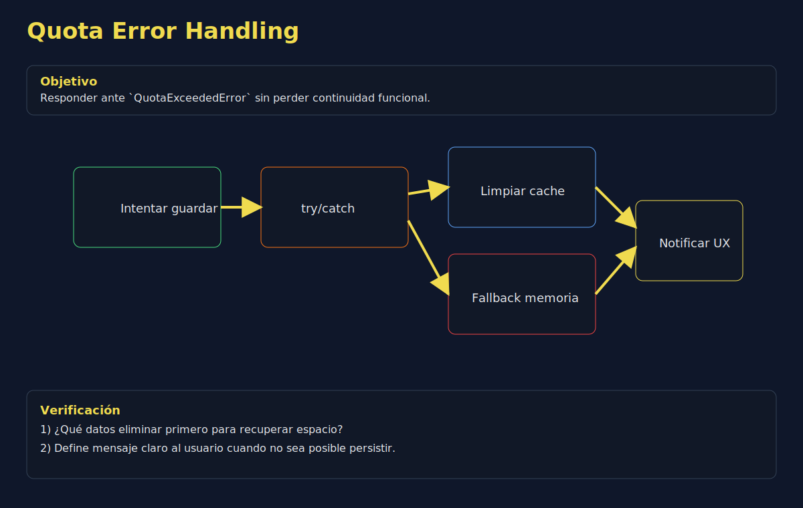
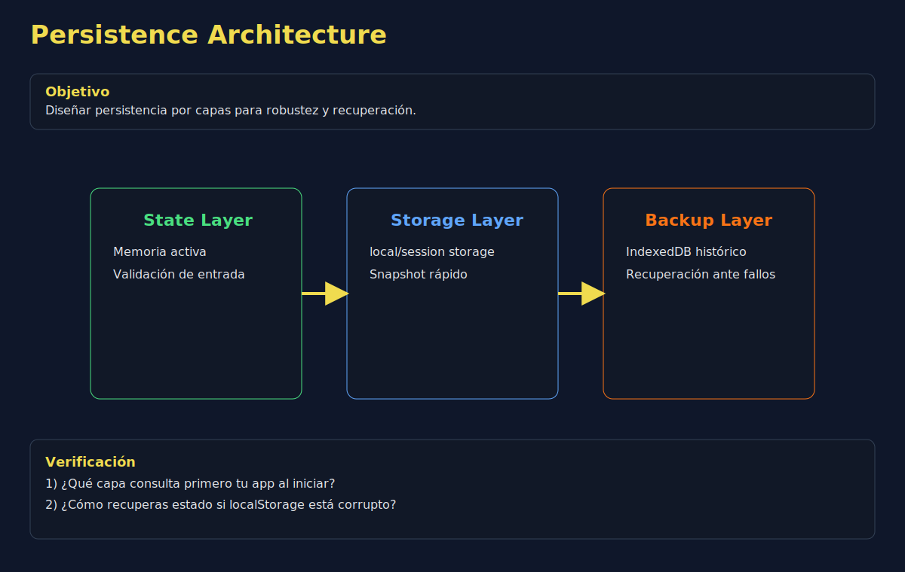

# 04. Cuotas, límites y estrategias

## 🎯 Objetivos

- Reconocer límites de almacenamiento del navegador
- Detectar errores por cuota excedida
- Aplicar estrategias de degradación y limpieza

---

## 🧠 Fundamento

El almacenamiento local tiene límites por origen. Si excedes la cuota, pueden ocurrir errores (ej. `QuotaExceededError`).

```javascript
const saveLargePayload = payload => {
  try {
    localStorage.setItem('app:cache', payload);
    return { ok: true };
  } catch (error) {
    return { ok: false, reason: error.name };
  }
};
```

---

## 🖼️ Recursos visuales





### Actividad guiada (10 min)

1. Simula fallo de escritura y captura error.
2. Implementa limpieza de claves no críticas.
3. Reintenta persistencia con payload reducido.

---

## ✅ Estrategias recomendadas

- Prioriza datos críticos sobre cachés temporales
- Define política de limpieza (`LRU` simple o por antigüedad)
- Implementa fallback a memoria cuando falle persistencia
- Reporta al usuario cuando no se pueda guardar

---

## ✅ Checklist

- [ ] Capturo y clasifico errores de almacenamiento
- [ ] Aplico limpieza/fallback cuando falla persistencia
- [ ] Mantengo continuidad funcional ante límites
