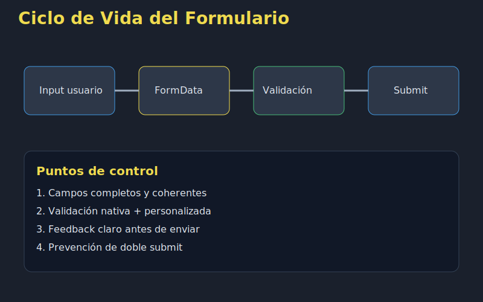
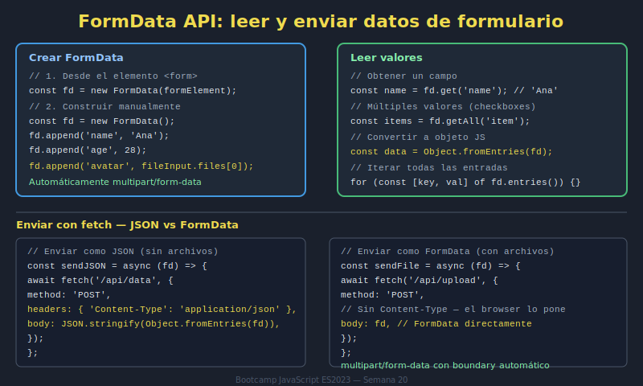

# 01. FormData API

## 🎯 Objetivos

- Capturar datos de formularios con `FormData`
- Convertir pares clave-valor en objetos útiles
- Preparar payloads para envío o persistencia

---

## 🧠 Fundamento

`FormData` permite leer datos de un `<form>` sin acceder campo por campo manualmente.

```javascript
const formData = new FormData(formElement);
for (const [key, value] of formData.entries()) {
  console.log(key, value);
}
```

También puedes transformar fácilmente a objeto:

```javascript
const payload = Object.fromEntries(new FormData(formElement));
```

---

## 🖼️ Recurso visual





---

## ✅ Buenas prácticas

- Mantener nombres de `name` consistentes en inputs
- Normalizar datos antes de validación
- Evitar lógica de transformación duplicada

---

## ✅ Checklist

- [ ] Capturo valores con FormData correctamente
- [ ] Convierto FormData a objeto cuando corresponde
- [ ] Estandarizo payload para siguientes pasos
