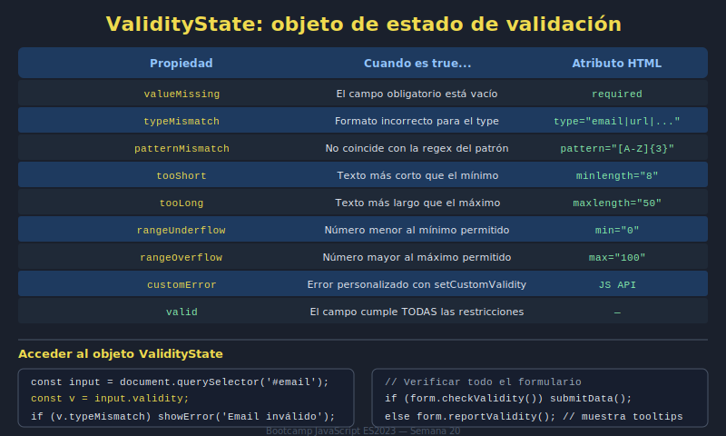

# 02. Validación HTML5

## 🎯 Objetivos

- Aplicar validaciones nativas con atributos HTML5
- Comprender estados `:valid` y `:invalid`
- Reducir validación manual innecesaria

---

## 🧠 Fundamento

La validación HTML5 se basa en atributos como:

- `required`
- `type="email"`
- `minlength` / `maxlength`
- `pattern`

```html
<input name="email" type="email" required />
<input name="password" type="password" minlength="8" required />
```

---

## 🖼️ Recurso visual



---

## ✅ Buenas prácticas

- Usar validación nativa como primera barrera
- Definir mensajes de apoyo claros en UI
- No depender solo del frontend en aplicaciones reales

---

## ⚠️ Errores comunes

- Omitir atributos clave (`required`, `type`)
- Usar patrones demasiado rígidos sin explicación
- Mostrar mensajes ambiguos

---

## ✅ Checklist

- [ ] Atributos HTML5 de validación bien definidos
- [ ] Estados visuales válidos/inválidos visibles
- [ ] Mensajería clara para corrección del usuario
