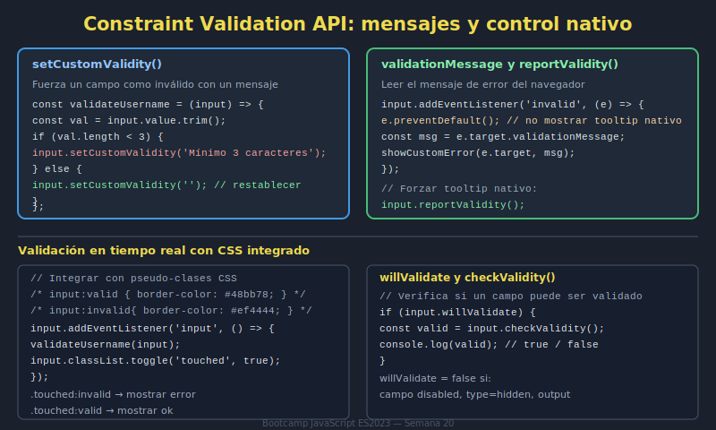

# 03. Constraint Validation API

## 🎯 Objetivos

- Consultar validez de campos y formulario
- Establecer mensajes personalizados
- Integrar reglas dinámicas con validación nativa

---

## 🧠 Fundamento

`Constraint Validation API` extiende la validación HTML5 con control programático.

```javascript
if (!input.checkValidity()) {
  input.reportValidity();
}
```

Puedes definir errores personalizados:

```javascript
input.setCustomValidity('El usuario debe tener al menos 6 caracteres');
```

Recuerda limpiar mensaje al validar correctamente:

```javascript
input.setCustomValidity('');
```

---

## 🖼️ Recurso visual



---

## ✅ Checklist

- [ ] Uso checkValidity/reportValidity correctamente
- [ ] Implemento setCustomValidity según reglas del dominio
- [ ] Limpio mensajes personalizados al corregir campo
