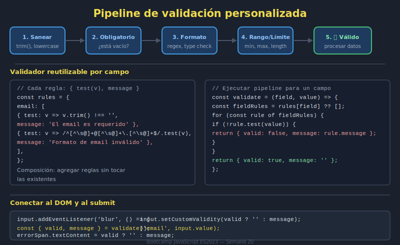

# 04. Validación personalizada y submit handling

## 🎯 Objetivos

- Combinar validación nativa y reglas de negocio
- Controlar envío con `preventDefault` cuando corresponda
- Evitar dobles envíos y estados inconsistentes

---

## 🧠 Fundamento

Un flujo típico de submit robusto:

1. Leer datos (`FormData`)
2. Ejecutar validación nativa
3. Ejecutar validación personalizada
4. Mostrar feedback
5. Enviar o bloquear envío

```javascript
form.addEventListener('submit', event => {
  event.preventDefault();

  if (!form.checkValidity()) {
    form.reportValidity();
    return;
  }

  const values = Object.fromEntries(new FormData(form));
  // Validaciones personalizadas...
});
```

---

## 🖼️ Recurso visual



---

## ✅ Buenas prácticas

- Deshabilitar botón submit durante envío
- Rehabilitar botón ante error
- Separar reglas de validación en funciones reutilizables

---

## ✅ Checklist

- [ ] Flujo de submit controlado y predecible
- [ ] Validaciones personalizadas encapsuladas
- [ ] Prevengo dobles envíos y feedback confuso
