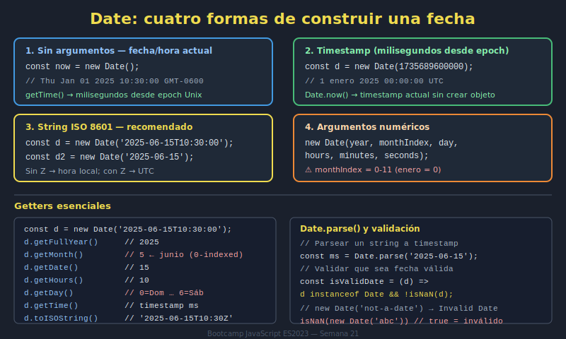

# 01. Date Object Básico

## 🎯 Objetivos

- Crear instancias de `Date` en distintos formatos
- Obtener partes de fecha y hora
- Entender timestamps en milisegundos

---

## 🧠 Fundamento

`Date` representa un instante temporal.

```javascript
const now = new Date();
const fromString = new Date('2026-04-12T10:30:00');
const fromTimestamp = new Date(1_776_000_000_000);
```

Lectura de partes:

```javascript
now.getFullYear();
now.getMonth(); // 0-11
now.getDate();
now.getHours();
```

---

## 🖼️ Recurso visual



---

## ✅ Checklist

- [ ] Creo fechas desde now/string/timestamp
- [ ] Extraigo partes de fecha correctamente
- [ ] Distingo índice de mes (0-11)
