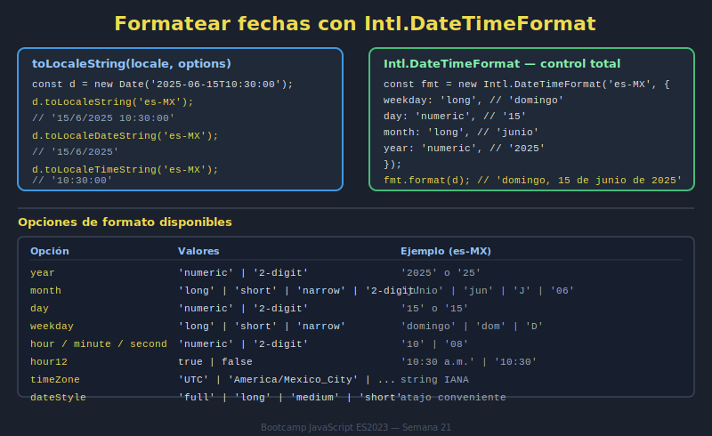

# 02. Formateo de Fechas

## 🎯 Objetivos

- Formatear fechas para distintos contextos
- Usar `toLocaleDateString` y `toLocaleTimeString`
- Mantener consistencia de presentación

---

## 🧠 Fundamento

El formateo depende del locale y opciones.

```javascript
const date = new Date('2026-04-12T10:30:00');

date.toLocaleDateString('es-CO');
date.toLocaleTimeString('es-CO');
```

Con opciones:

```javascript
date.toLocaleString('es-CO', {
  dateStyle: 'medium',
  timeStyle: 'short'
});
```

---

## 🖼️ Recurso visual



---

## ✅ Checklist

- [ ] Formateo fecha y hora con locale adecuado
- [ ] Uso opciones de formato según contexto
- [ ] Mantengo un formato consistente en la UI
