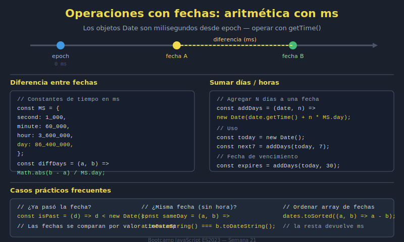

# 03. Operaciones con Fechas

## 🎯 Objetivos

- Sumar/restar días y horas
- Calcular diferencias entre fechas
- Ordenar eventos temporalmente

---

## 🧠 Fundamento

Las operaciones se hacen sobre timestamps.

```javascript
const dayMs = 24 * 60 * 60 * 1000;
const now = Date.now();
const tomorrow = new Date(now + dayMs);
```

Diferencia en días:

```javascript
const diffMs = endDate.getTime() - startDate.getTime();
const diffDays = Math.floor(diffMs / dayMs);
```

---

## 🖼️ Recurso visual



---

## ✅ Checklist

- [ ] Sumo/resto tiempo usando milisegundos
- [ ] Calculo diferencias de forma consistente
- [ ] Ordeno eventos por fecha correctamente
