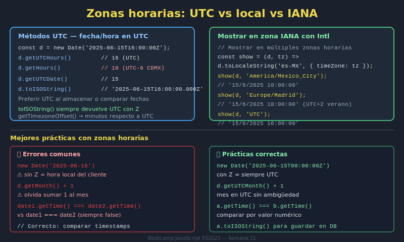
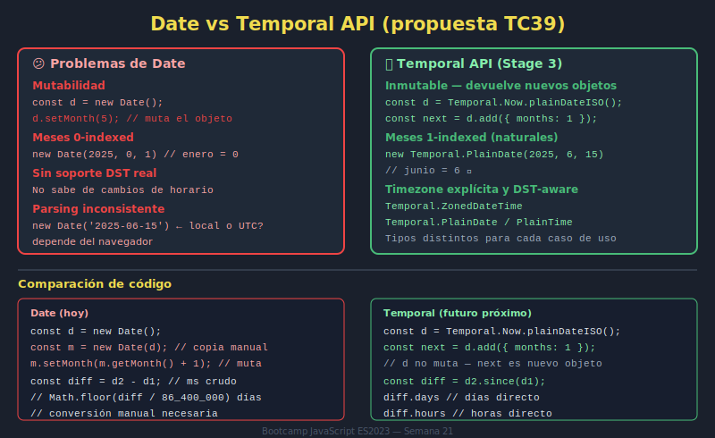

# 04. Timezones y Temporal API (Introducción)

## 🎯 Objetivos

- Comprender impacto de zonas horarias
- Evitar errores comunes en conversión temporal
- Conocer propuesta `Temporal` a nivel introductorio

---

## 🧠 Fundamento

Una fecha/hora local puede representarse distinto según zona horaria.

```javascript
const date = new Date('2026-04-12T10:30:00Z');

date.toLocaleString('es-CO', { timeZone: 'America/Bogota' });
date.toLocaleString('es-ES', { timeZone: 'Europe/Madrid' });
```

`Temporal` (en etapa de adopción) busca resolver limitaciones de `Date` con tipos más explícitos.

---

## 🖼️ Recursos visuales





---

## ✅ Checklist

- [ ] Identifico diferencias por zona horaria
- [ ] Evito asumir que una hora local es universal
- [ ] Reconozco cuándo `Temporal` sería una mejor alternativa
