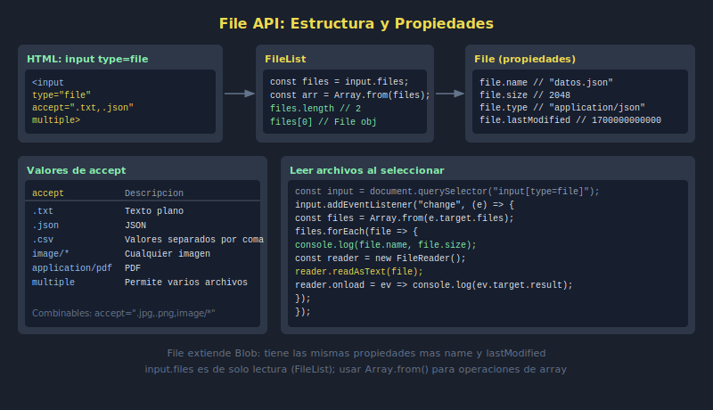

# 01. File API

## 🎯 Objetivos

- Comprender el objeto `File` y sus propiedades
- Acceder a archivos desde `input[type=file]`
- Filtrar archivos por tipo con el atributo `accept`

---

## 🧠 Fundamento

El navegador expone archivos del sistema a través de la **File API**. Un `File` es una extensión de `Blob` con metadatos adicionales.

```javascript
// Acceder a archivos desde un input
const input = document.querySelector('#fileInput');

input.addEventListener('change', e => {
  const files = e.target.files; // FileList (similar a un array)
  const file = files[0];

  // Propiedades del objeto File
  console.log(file.name);         // "documento.txt"
  console.log(file.size);         // 1024 (bytes)
  console.log(file.type);         // "text/plain"
  console.log(file.lastModified); // timestamp en ms
});
```

---

## 📦 La interfaz FileList

`input.files` devuelve un `FileList`, no un array ordinario. Para trabajar con él:

```javascript
const fileList = input.files;

// Convertir a array real para usar métodos modernos
const filesArray = Array.from(fileList);

filesArray.forEach(file => {
  console.log(`${file.name} — ${(file.size / 1024).toFixed(1)} KB`);
});
```

---

## ⚙️ Atributos del input

| Atributo | Función | Ejemplo |
|----------|---------|---------|
| `accept` | Filtra tipos de archivo | `accept=".txt,.json"` |
| `multiple` | Permite selección múltiple | `<input multiple>` |

```html
<!-- Solo imágenes -->
<input type="file" accept="image/*">

<!-- Múltiples archivos txt o json -->
<input type="file" accept=".txt,.json" multiple>
```

---

## 🖼️ Recurso visual



---

## ✅ Checklist

- [ ] Accedo a archivos con `input.files`
- [ ] Leo nombre, tamaño y tipo de un `File`
- [ ] Convierto `FileList` a array con `Array.from()`
- [ ] Uso `accept` para limitar tipos permitidos
