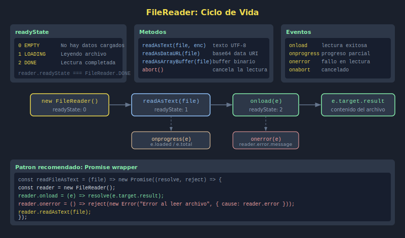

# 02. FileReader

## 🎯 Objetivos

- Leer el contenido de un archivo con `FileReader`
- Manejar los eventos `onload`, `onerror` y `onprogress`
- Envolver FileReader en una Promesa para usar con `async/await`

---

## 🧠 Fundamento

`FileReader` lee el contenido de un archivo de forma **asíncrona** dentro del navegador, sin necesidad de enviarlo a un servidor.

```javascript
const reader = new FileReader();

reader.onload = e => {
  // e.target.result contiene el contenido leído
  console.log(e.target.result);
};

reader.onerror = () => {
  console.error('Error al leer el archivo');
};

// Iniciar lectura (asíncrona)
reader.readAsText(file, 'UTF-8');
```

---

## 📖 Métodos de lectura

| Método | Resultado en `result` | Uso típico |
|--------|-----------------------|------------|
| `readAsText(file)` | String con el texto | .txt, .csv, .json |
| `readAsDataURL(file)` | `data:tipo/base64,...` | Previsualizar imágenes |
| `readAsArrayBuffer(file)` | `ArrayBuffer` | Archivos binarios |

---

## 🔄 Estados del FileReader

```javascript
// readyState: 0 = EMPTY, 1 = LOADING, 2 = DONE
console.log(reader.readyState); // 0 antes de leer

reader.onprogress = e => {
  if (e.lengthComputable) {
    const percent = Math.round((e.loaded / e.total) * 100);
    console.log(`Leyendo: ${percent}%`);
  }
};
```

---

## ⚡ Envolver en Promise

La forma moderna es encapsular `FileReader` en una promesa para poder usar `async/await`:

```javascript
const readFileAsText = file =>
  new Promise((resolve, reject) => {
    const reader = new FileReader();
    reader.onload = e => resolve(e.target.result);
    reader.onerror = () =>
      reject(new Error(`No se pudo leer: ${file.name}`));
    reader.readAsText(file, 'UTF-8');
  });

// Uso con async/await
const handleFile = async file => {
  try {
    const content = await readFileAsText(file);
    console.log('Contenido:', content);
  } catch (error) {
    console.error(error.message);
  }
};
```

---

## 🖼️ Recurso visual



---

## ✅ Checklist

- [ ] Creo un `FileReader` y uso `readAsText`
- [ ] Escucho el evento `onload` para obtener el resultado
- [ ] Manejo `onerror` correctamente
- [ ] Envuelvo FileReader en una Promesa
- [ ] Uso `async/await` para leer archivos
