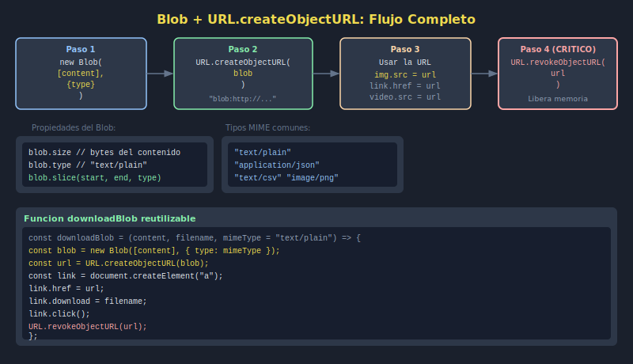

# 03. Blob y URL.createObjectURL

## 🎯 Objetivos

- Crear objetos `Blob` con contenido dinámico
- Generar URLs temporales con `URL.createObjectURL`
- Revocar URLs para liberar memoria con `URL.revokeObjectURL`

---

## 🧠 El objeto Blob

`Blob` (_Binary Large Object_) representa datos en bruto: texto, imágenes, archivos generados dinámicamente.

```javascript
// Crear un Blob de texto
const textBlob = new Blob(['Hola mundo'], { type: 'text/plain' });

// Crear un Blob de JSON
const data = { name: 'Ejemplo', version: 1 };
const jsonBlob = new Blob(
  [JSON.stringify(data, null, 2)],
  { type: 'application/json' }
);

console.log(textBlob.size); // bytes
console.log(textBlob.type); // "text/plain"
```

---

## 🔗 URL.createObjectURL

Genera una URL temporal (`blob:…`) que el navegador puede abrir o descargar:

```javascript
const blob = new Blob(['contenido del archivo'], { type: 'text/plain' });
const url = URL.createObjectURL(blob);

// Usar en una imagen
const img = document.querySelector('img');
img.src = url;

// Usar para descarga
const link = document.createElement('a');
link.href = url;
link.download = 'resultado.txt';
link.click();
```

---

## 🧹 Revocar la URL (importante)

Las Object URLs permanecen en memoria hasta que se revocan o la pestaña se cierra. **Siempre revocar** cuando ya no sean necesarias:

```javascript
// Revocar después de usar
URL.revokeObjectURL(url);
```

```javascript
// Patrón completo de descarga
const downloadBlob = (content, filename, mimeType = 'text/plain') => {
  const blob = new Blob([content], { type: mimeType });
  const url = URL.createObjectURL(blob);

  const link = document.createElement('a');
  link.href = url;
  link.download = filename;
  document.body.appendChild(link);
  link.click();
  document.body.removeChild(link);

  // Limpiar la URL de memoria
  URL.revokeObjectURL(url);
};
```

---

## 🖼️ Recurso visual



---

## ✅ Checklist

- [ ] Creo un `Blob` con texto o JSON
- [ ] Genero una URL con `URL.createObjectURL`
- [ ] Uso la URL en una imagen o enlace de descarga
- [ ] Revoco la URL con `URL.revokeObjectURL` cuando termino
