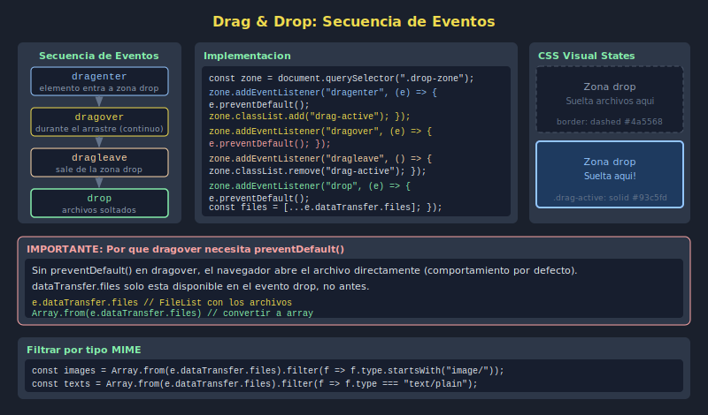

# 04. Drag and Drop

## 🎯 Objetivos

- Capturar archivos arrastrados sobre una zona del DOM
- Manejar los eventos `dragover` y `drop`
- Dar feedback visual durante el arrastre
- Combinar drag & drop con File API

---

## 🧠 Fundamento

El API de Drag and Drop permite que el usuario arrastre archivos desde su explorador de archivos directamente a la página.

```javascript
const dropZone = document.querySelector('#dropZone');

// Prevenir comportamiento por defecto del navegador (abrir el archivo)
dropZone.addEventListener('dragover', e => {
  e.preventDefault();
});

// Capturar archivos al soltar
dropZone.addEventListener('drop', e => {
  e.preventDefault(); // evitar navegación o apertura del archivo

  const files = e.dataTransfer.files; // FileList con los archivos soltados
  console.log(`Archivos recibidos: ${files.length}`);
  Array.from(files).forEach(file => console.log(file.name));
});
```

---

## 🎨 Feedback visual con dragenter / dragleave

```javascript
// Añadir clase CSS al entrar y quitarla al salir
dropZone.addEventListener('dragenter', () => {
  dropZone.classList.add('drag-active');
});

dropZone.addEventListener('dragleave', () => {
  dropZone.classList.remove('drag-active');
});

dropZone.addEventListener('drop', e => {
  e.preventDefault();
  dropZone.classList.remove('drag-active');

  // Procesar archivos
  const { files } = e.dataTransfer;
  handleFiles(files);
});
```

---

## 📋 Secuencia de eventos

| Evento | Cuándo dispara |
|--------|----------------|
| `dragenter` | El cursor entra en la zona |
| `dragover` | El cursor se mueve sobre la zona (repetitivo) |
| `dragleave` | El cursor sale de la zona |
| `drop` | El usuario suelta el/los archivo(s) |

---

## ⚠️ Sin `preventDefault` en dragover

Si no se llama a `e.preventDefault()` en `dragover`, el evento `drop` **no se disparará**. Es el error más común al implementar drag & drop.

---

## 🖼️ Recurso visual



---

## ✅ Checklist

- [ ] Prevengo el comportamiento por defecto en `dragover`
- [ ] Capturo archivos en `e.dataTransfer.files`
- [ ] Añado clase CSS activa con `dragenter` / `dragleave`
- [ ] Remuevo la clase activa en `drop`
- [ ] Proceso el `FileList` igual que con un input
