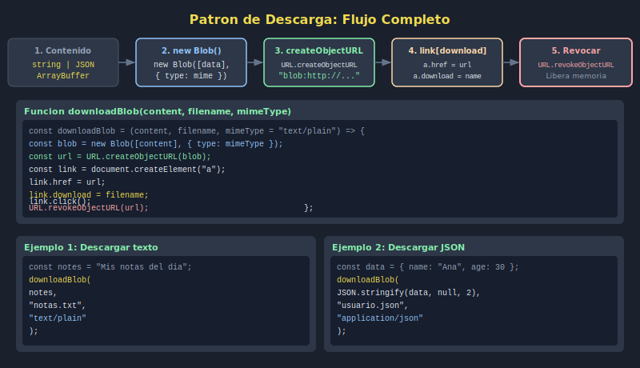

# 05. Download de Archivos

## 🎯 Objetivos

- Generar archivos descargables con contenido creado en JavaScript
- Usar el atributo `download` de un enlace `<a>`
- Limpiar recursos de memoria correctamente tras la descarga

---

## 🧠 Fundamento

Para descargar contenido generado en JavaScript, se crea un `Blob`, se genera una URL temporal y se simula un clic en un enlace con el atributo `download`:

```javascript
const downloadText = (content, filename) => {
  const blob = new Blob([content], { type: 'text/plain' });
  const url = URL.createObjectURL(blob);

  const link = document.createElement('a');
  link.href = url;
  link.download = filename; // nombre del archivo descargado
  link.click();

  URL.revokeObjectURL(url); // limpiar memoria
};

// Uso
downloadText('Hola desde JavaScript', 'saludo.txt');
```

---

## 📂 Descargar JSON

```javascript
const downloadJSON = (data, filename) => {
  const content = JSON.stringify(data, null, 2);
  const blob = new Blob([content], { type: 'application/json' });
  const url = URL.createObjectURL(blob);

  const link = document.createElement('a');
  link.href = url;
  link.download = filename;
  link.click();

  URL.revokeObjectURL(url);
};

// Uso
const report = { total: 42, items: ['a', 'b', 'c'] };
downloadJSON(report, 'reporte.json');
```

---

## 🔁 Función genérica reutilizable

```javascript
const downloadBlob = (content, filename, mimeType = 'text/plain') => {
  const blob = new Blob([content], { type: mimeType });
  const url = URL.createObjectURL(blob);

  const link = Object.assign(document.createElement('a'), {
    href: url,
    download: filename,
  });

  link.click();
  URL.revokeObjectURL(url);
};
```

---

## ⚠️ Consideraciones

| Punto | Detalle |
|-------|---------|
| `URL.revokeObjectURL` | Llamar siempre después del clic para liberar memoria |
| `link.click()` sin append | Funciona en la mayoría de navegadores; si falla, agregar al DOM temporalmente |
| Nombre del archivo | El atributo `download` puede ser ignorado en descargas cross-origin |

---

## 🖼️ Recurso visual



---

## ✅ Checklist

- [ ] Creo un `Blob` con el contenido a descargar
- [ ] Genero una URL y la asigno a `link.href`
- [ ] Establezco `link.download` con el nombre de archivo deseado
- [ ] Simulo el clic en el enlace
- [ ] Revoco la URL con `URL.revokeObjectURL` inmediatamente después
